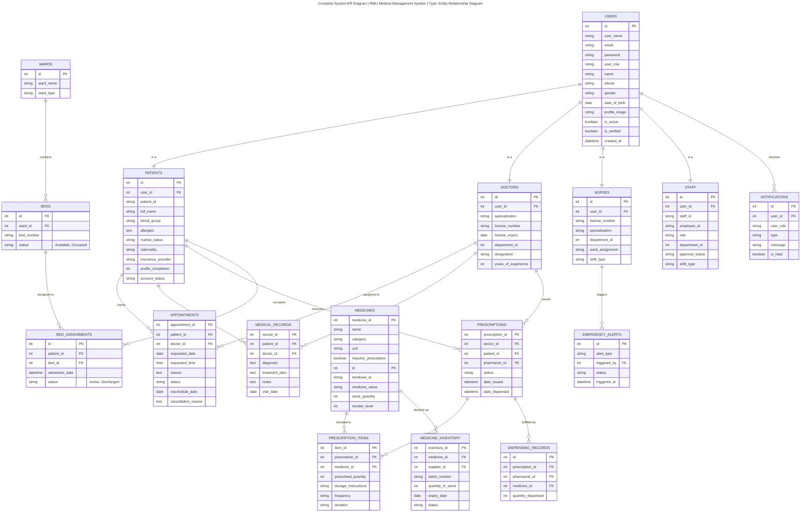

# RMU Medical Sickbay System - Entity Relationship (ER) Diagram

This document contains the comprehensive Entity Relationship diagram modeling the core structure of the RMU Medical Sickbay System's MySQL database.

## Conventions & Legends
- **Entities:** Represented as boxes with the entity name in the header.
- **Attributes:** Listed inside the entity box.
- **Keys:** Primary Keys are denoted with `PK`. Foreign Keys are denoted with `FK`.
- **Relationships:** Labeled lines connecting entities showing the action.
- **Cardinality:** Crow's foot notation representing `1`, `M`, or `N` relationships.
  - `||--o{` : Exactly 1 to Zero-or-Many (1:M)
  - `||--||` : Exactly 1 to Exactly 1 (1:1)
  - `}o--||` : Zero-or-Many to Exactly 1 (M:1)

---

## Complete System ER Diagram
**Type:** Entity Relationship Diagram

