# RMU Medical Sickbay System - Flowchart Diagrams

This document contains detailed flowchart diagrams mapping three critical functional workflows of the RMU Medical Sickbay System. The flowcharts adhere to the standard shapes and routing notation via Mermaid JS.

## Conventions & Legends
- **Start/End:** Stadium shape `([ ])`
- **Process Steps:** Rectangle `[ ]`
- **Decisions:** Diamond `{ }` (Branches labeled)
- **Data I/O:** Parallelogram `[/ /]`
- **Database Operations:** Cylinder `[( )]`
- **Role Color Coding:**
  - Admin: `Red`
  - Doctor: `Blue`
  - Nurse: `Green`
  - Pharmacist: `Purple`
  - Patient: `Orange`
  - System/DB: `Gray`

---

## 1. Patient Appointment Booking Workflow
**Roles Involved:** Patient, System DB, Doctor 
**Type:** Flowchart Diagram

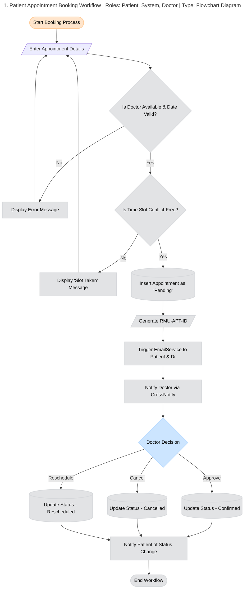
```mermaid
---
title: "1. Patient Appointment Booking Workflow | Roles: Patient, System, Doctor | Type: Flowchart Diagram"
---
flowchart TD
    %% Style Definitions
    classDef doctor fill:#cce5ff,stroke:#b8daff,stroke-width:2px,color:#000;
    classDef patient fill:#ffe5cc,stroke:#ffcc99,stroke-width:2px,color:#000;
    classDef sys fill:#e2e3e5,stroke:#d6d8db,stroke-width:2px,color:#000;

    Start([Start Booking Process]):::patient --> Input[/Enter Appointment Details/]
    Input --> Validate{Is Doctor Available & Date Valid?}:::sys
    
    Validate -->|No| ShowErr[Display Error Message]:::sys
    ShowErr --> Input
    
    Validate -->|Yes| Conflict{Is Time Slot Conflict-Free?}:::sys
    Conflict -->|No| ShowErr2[Display 'Slot Taken' Message]:::sys
    ShowErr2 --> Input
    
    Conflict -->|Yes| QueryDB[(Insert Appointment as 'Pending')]:::sys
    QueryDB --> GenID[/Generate RMU-APT-ID/]:::sys
    
    GenID --> SendEmail[Trigger EmailService to Patient & Dr]:::sys
    SendEmail --> NotifDr[Notify Doctor via CrossNotify]:::sys
    
    NotifDr --> DrAction{Doctor Decision}:::doctor
    
    DrAction -->|Approve| UpdateAppr[(Update Status - Confirmed)]:::sys
    DrAction -->|Cancel| UpdateCanc[(Update Status - Cancelled)]:::sys
    DrAction -->|Reschedule| UpdateResc[(Update Status - Rescheduled)]:::sys
    
    UpdateAppr --> NotifPat[Notify Patient of Status Change]:::sys
    UpdateCanc --> NotifPat
    UpdateResc --> NotifPat
    
    NotifPat --> EndNode([End Workflow]):::sys
```

---

## 2. Pharmacy Dispensing & Stock Alert Workflow
**Roles Involved:** Pharmacist, System DB, Doctor, Patient
**Type:** Flowchart Diagram

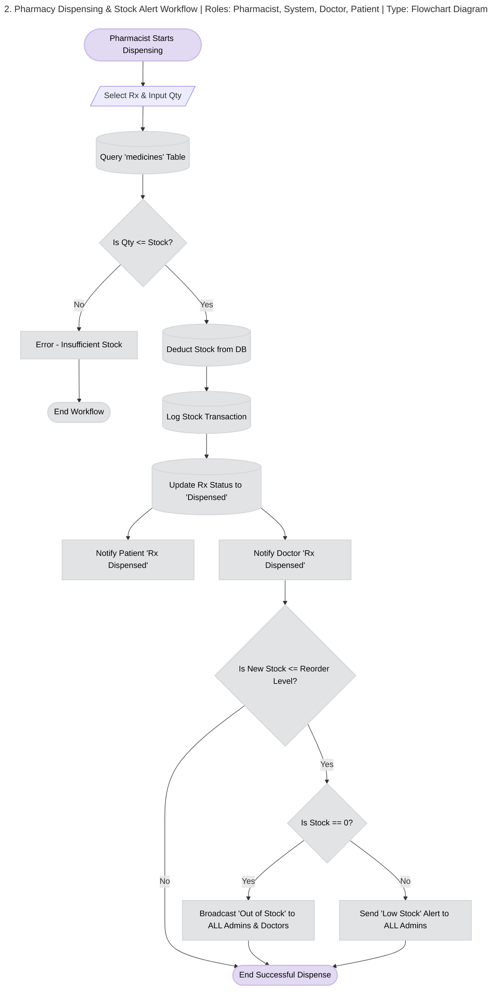
```mermaid
---
title: "2. Pharmacy Dispensing & Stock Alert Workflow | Roles: Pharmacist, System, Doctor, Patient | Type: Flowchart Diagram"
---
flowchart TD
    %% Style Definitions
    classDef doctor fill:#cce5ff,stroke:#b8daff,stroke-width:2px,color:#000;
    classDef pharmacist fill:#e2d9f3,stroke:#cbbce5,stroke-width:2px,color:#000;
    classDef patient fill:#ffe5cc,stroke:#ffcc99,stroke-width:2px,color:#000;
    classDef admin fill:#f8d7da,stroke:#f5c6cb,stroke-width:2px,color:#000;
    classDef sys fill:#e2e3e5,stroke:#d6d8db,stroke-width:2px,color:#000;

    Start([Pharmacist Starts Dispensing]):::pharmacist --> Input[/Select Rx & Input Qty/]
    Input --> FetchDB[(Query 'medicines' Table)]:::sys
    
    FetchDB --> StockCheck{Is Qty <= Stock?}:::sys
    StockCheck -->|No| ShowErr[Error - Insufficient Stock]:::sys
    ShowErr --> EndNode([End Workflow]):::sys
    
    StockCheck -->|Yes| DedDB[(Deduct Stock from DB)]:::sys
    DedDB --> LogTx[(Log Stock Transaction)]:::sys
    LogTx --> RxStat[(Update Rx Status to 'Dispensed')]:::sys
    
    RxStat --> NotifPat[Notify Patient 'Rx Dispensed']:::sys
    RxStat --> NotifDoc[Notify Doctor 'Rx Dispensed']:::sys
    
    NotifDoc --> AlertCheck{Is New Stock <= Reorder Level?}:::sys
    
    AlertCheck -->|No| EndDisp([End Successful Dispense]):::pharmacist
    
    AlertCheck -->|Yes| ZeroCheck{Is Stock == 0?}:::sys
    
    ZeroCheck -->|Yes| WarnZero[Broadcast 'Out of Stock' to ALL Admins & Doctors]:::sys
    WarnZero --> EndDisp
    
    ZeroCheck -->|No| WarnLow[Send 'Low Stock' Alert to ALL Admins]:::sys
    WarnLow --> EndDisp
```

---

## 3. Abnormal Vitals & Emergency Trigger Workflow
**Roles Involved:** Nurse, System Notification Bus, Doctor, Admin
**Type:** Flowchart Diagram

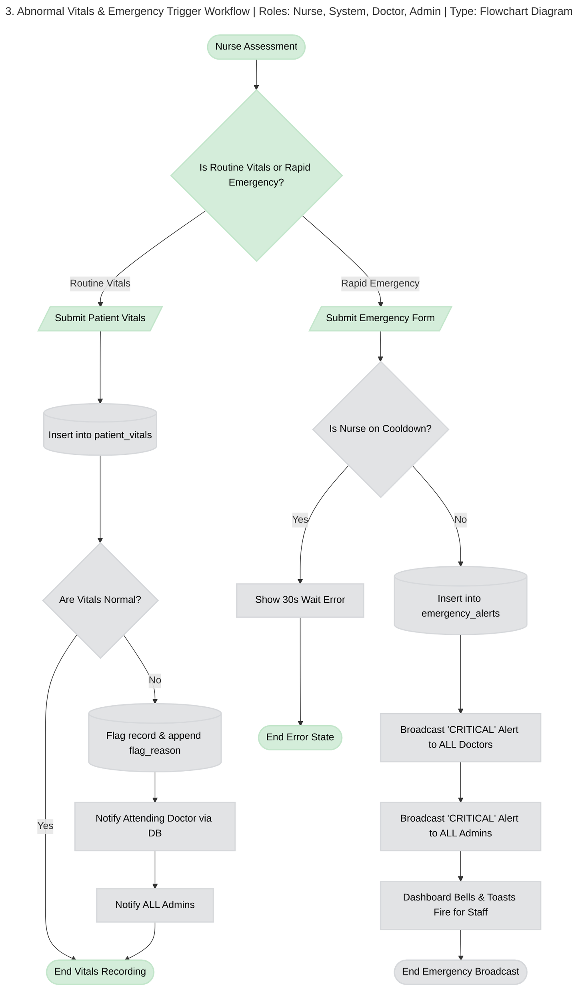
```mermaid
---
title: "3. Abnormal Vitals & Emergency Trigger Workflow | Roles: Nurse, System, Doctor, Admin | Type: Flowchart Diagram"
---
flowchart TD
    %% Style Definitions
    classDef admin fill:#f8d7da,stroke:#f5c6cb,stroke-width:2px,color:#000;
    classDef doctor fill:#cce5ff,stroke:#b8daff,stroke-width:2px,color:#000;
    classDef nurse fill:#d4edda,stroke:#c3e6cb,stroke-width:2px,color:#000;
    classDef sys fill:#e2e3e5,stroke:#d6d8db,stroke-width:2px,color:#000;

    Start([Nurse Assessment]):::nurse --> Tool{Is Routine Vitals or Rapid Emergency?}:::nurse
    
    %% Branch 1: Routine Vitals
    Tool -->|Routine Vitals| Input[/Submit Patient Vitals/]:::nurse
    Input --> LogicDB[(Insert into patient_vitals)]:::sys
    LogicDB --> Eval{Are Vitals Normal?}:::sys
    
    Eval -->|Yes| EndVital([End Vitals Recording]):::nurse
    Eval -->|No| FlagVital[(Flag record & append flag_reason)]:::sys
    
    FlagVital --> NotifAtt[Notify Attending Doctor via DB]:::sys
    NotifAtt --> NotifAdmin[Notify ALL Admins]:::sys
    NotifAdmin --> EndVital
    
    %% Branch 2: Rapid Emergency Trigger
    Tool -->|Rapid Emergency| InputE[/Submit Emergency Form/]:::nurse
    InputE --> CoolDown{Is Nurse on Cooldown?}:::sys
    
    CoolDown -->|Yes| ErrCool[Show 30s Wait Error]:::sys
    ErrCool --> EndErr([End Error State]):::nurse
    
    CoolDown -->|No| CreateE[(Insert into emergency_alerts)]:::sys
    CreateE --> BroadDoc[Broadcast 'CRITICAL' Alert to ALL Doctors]:::sys
    BroadDoc --> BroadAdm[Broadcast 'CRITICAL' Alert to ALL Admins]:::sys
    
    BroadAdm --> Escalate[Dashboard Bells & Toasts Fire for Staff]:::sys
    Escalate --> EndStatus([End Emergency Broadcast]):::sys
```

---

## 4. Admin Staff Management Workflow
**Roles Involved:** Admin, System DB, New Staff
**Type:** Flowchart Diagram

```mermaid
---
title: "4. Admin Staff Management Workflow | Roles: Admin, System, Staff | Type: Flowchart Diagram"
---
flowchart TD
    %% Style Definitions
    classDef admin fill:#f8d7da,stroke:#f5c6cb,stroke-width:2px,color:#000;
    classDef sys fill:#e2e3e5,stroke:#d6d8db,stroke-width:2px,color:#000;
    classDef staff fill:#e0e0e0,stroke:#d6d8db,stroke-width:2px,color:#000;

    Start([Admin Logs In]):::admin --> Input[/Create New Staff Profile/]
    Input --> DBAction[(Insert into users table)]:::sys
    
    DBAction --> TypeCheck{Is Role Specific? (e.g., Nurse, Driver)}:::sys
    
    TypeCheck -->|Yes| ProfileDB[(Insert into specific role table)]:::sys
    TypeCheck -->|No| GenDB[(Insert into general staff table)]:::sys
    
    ProfileDB --> SetActive[(Set is_active = 1)]:::sys
    GenDB --> SetActive
    
    SetActive --> NotifStaff[Send Welcome Email via EmailService]:::sys
    NotifStaff --> EndNew([End Creation]):::admin
```

---

## 5. Support Staff Approval Gate Workflow
**Roles Involved:** Support Staff (Driver/Cleaner), System DB, Admin
**Type:** Flowchart Diagram

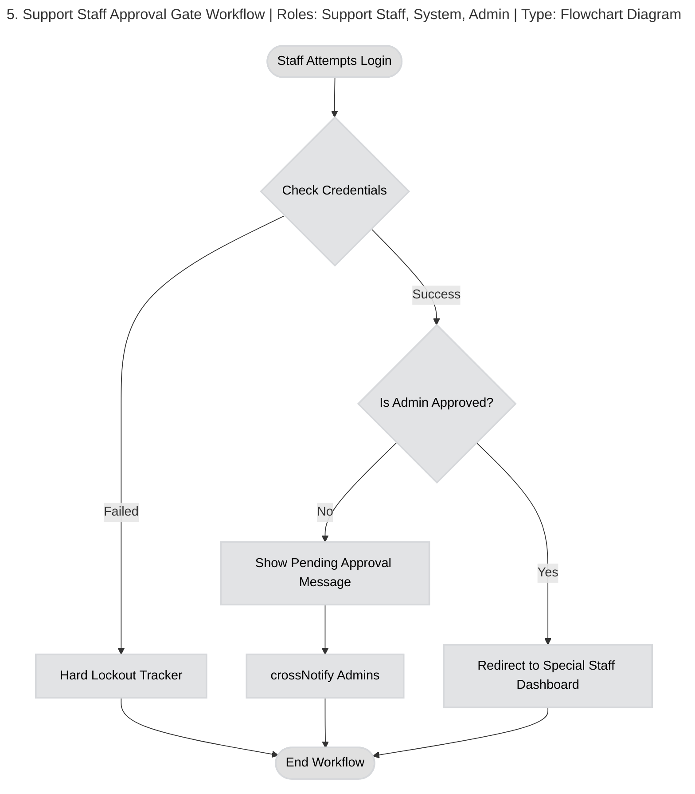
```mermaid
---
title: "5. Support Staff Approval Gate Workflow | Roles: Support Staff, System, Admin | Type: Flowchart Diagram"
---
flowchart TD
    %% Style Definitions
    classDef admin fill:#f8d7da,stroke:#f5c6cb,stroke-width:2px,color:#000;
    classDef sys fill:#e2e3e5,stroke:#d6d8db,stroke-width:2px,color:#000;
    classDef staff fill:#e0e0e0,stroke:#d6d8db,stroke-width:2px,color:#000;

    Start([Staff Attempts Login]):::staff --> Auth{Check Credentials}:::sys
    
    Auth -->|Failed| ErrBlock[Hard Lockout Tracker]:::sys
    ErrBlock --> EndNode
    
    Auth -->|Success| Gate{Is Admin Approved?}:::sys
    
    Gate -->|No| ErrPending[Show Pending Approval Message]:::sys
    ErrPending --> AlertAdmin[crossNotify Admins]:::sys
    AlertAdmin --> EndNode([End Workflow]):::staff
    
    Gate -->|Yes| RouteDash[Redirect to Special Staff Dashboard]:::sys
    RouteDash --> EndNode
```

---

## 6. Patient - Appointment Booking Flow
**Roles Involved:** Patient, System, Doctor
**Type:** Flowchart Diagram

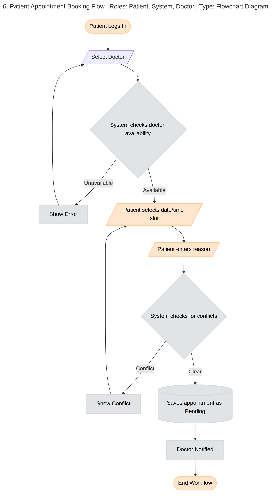
```mermaid
---
title: "6. Patient Appointment Booking Flow | Roles: Patient, System, Doctor | Type: Flowchart Diagram"
---
flowchart TD
    classDef doctor fill:#cce5ff,stroke:#b8daff,stroke-width:2px,color:#000;
    classDef patient fill:#ffe5cc,stroke:#ffcc99,stroke-width:2px,color:#000;
    classDef sys fill:#e2e3e5,stroke:#d6d8db,stroke-width:2px,color:#000;

    Start([Patient Logs In]):::patient --> SelectDoc[/Select Doctor/]
    SelectDoc --> ChkDoc{System checks doctor availability}:::sys
    
    ChkDoc -->|Unavailable| Err[Show Error]:::sys
    Err --> SelectDoc
    
    ChkDoc -->|Available| SelectDate[/Patient selects date/time slot/]:::patient
    SelectDate --> EnterReason[/Patient enters reason/]:::patient
    EnterReason --> ChkConf{System checks for conflicts}:::sys
    
    ChkConf -->|Conflict| ErrConf[Show Conflict]:::sys
    ErrConf --> SelectDate
    
    ChkConf -->|Clear| SaveDB[(Saves appointment as Pending)]:::sys
    SaveDB --> AlertDoc[Doctor Notified]:::sys
    AlertDoc --> EndNode([End Workflow]):::patient
```

---

## 7. Patient - View Lab Results Flow
**Roles Involved:** Patient, System
**Type:** Flowchart Diagram

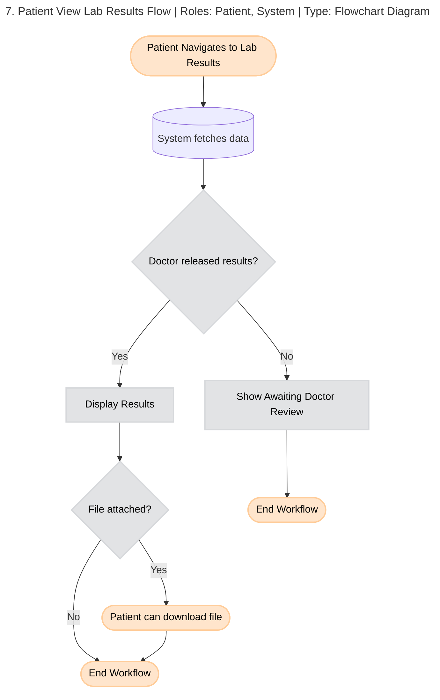
```mermaid
---
title: "7. Patient View Lab Results Flow | Roles: Patient, System | Type: Flowchart Diagram"
---
flowchart TD
    classDef patient fill:#ffe5cc,stroke:#ffcc99,stroke-width:2px,color:#000;
    classDef sys fill:#e2e3e5,stroke:#d6d8db,stroke-width:2px,color:#000;

    Start([Patient Navigates to Lab Results]):::patient --> FetchDB[(System fetches data)]
    FetchDB --> ChkRel{Doctor released results?}:::sys
    
    ChkRel -->|Yes| DispRes[Display Results]:::sys
    DispRes --> OptDown{File attached?}:::sys
    
    OptDown -->|Yes| CanDown([Patient can download file]):::patient
    OptDown -->|No| End1([End Workflow]):::patient
    CanDown --> End1
    
    ChkRel -->|No| ShowWait[Show Awaiting Doctor Review]:::sys
    ShowWait --> End2([End Workflow]):::patient
```

---

## 8. Patient - Prescription Refill Flow
**Roles Involved:** Patient, System, Doctor
**Type:** Flowchart Diagram

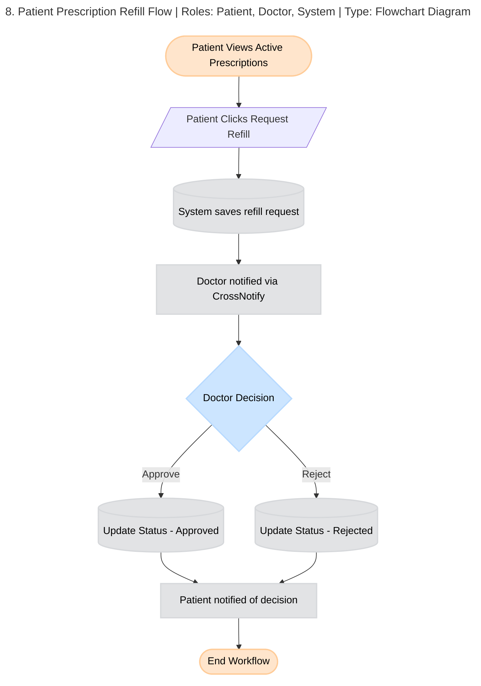
```mermaid
---
title: "8. Patient Prescription Refill Flow | Roles: Patient, Doctor, System | Type: Flowchart Diagram"
---
flowchart TD
    classDef doctor fill:#cce5ff,stroke:#b8daff,stroke-width:2px,color:#000;
    classDef patient fill:#ffe5cc,stroke:#ffcc99,stroke-width:2px,color:#000;
    classDef sys fill:#e2e3e5,stroke:#d6d8db,stroke-width:2px,color:#000;

    Start([Patient Views Active Prescriptions]):::patient --> ReqRefill[/Patient Clicks Request Refill/]
    ReqRefill --> SaveDB[(System saves refill request)]:::sys
    SaveDB --> NotifDoc[Doctor notified via CrossNotify]:::sys
    
    NotifDoc --> DocAct{Doctor Decision}:::doctor
    
    DocAct -->|Approve| ActAppr[(Update Status - Approved)]:::sys
    DocAct -->|Reject| ActRej[(Update Status - Rejected)]:::sys
    
    ActAppr --> NotifPat[Patient notified of decision]:::sys
    ActRej --> NotifPat
    NotifPat --> EndNode([End Workflow]):::patient
```

---

## 9. Doctor - Appointment Management Flow
**Roles Involved:** Doctor, System, Patient
**Type:** Flowchart Diagram

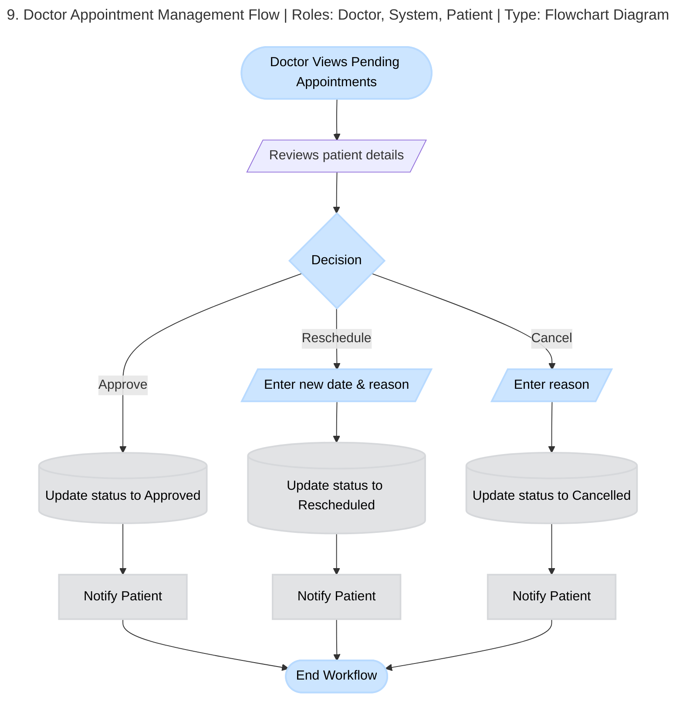
```mermaid
---
title: "9. Doctor Appointment Management Flow | Roles: Doctor, System, Patient | Type: Flowchart Diagram"
---
flowchart TD
    classDef doctor fill:#cce5ff,stroke:#b8daff,stroke-width:2px,color:#000;
    classDef patient fill:#ffe5cc,stroke:#ffcc99,stroke-width:2px,color:#000;
    classDef sys fill:#e2e3e5,stroke:#d6d8db,stroke-width:2px,color:#000;

    Start([Doctor Views Pending Appointments]):::doctor --> Review[/Reviews patient details/]
    Review --> Decision{Decision}:::doctor
    
    Decision -->|Approve| ActAppr[(Update status to Approved)]:::sys
    ActAppr --> NotifAppr[Notify Patient]:::sys
    NotifAppr --> EndNode([End Workflow]):::doctor
    
    Decision -->|Reschedule| OptRes[/Enter new date & reason/]:::doctor
    OptRes --> ActRes[(Update status to Rescheduled)]:::sys
    ActRes --> NotifRes[Notify Patient]:::sys
    NotifRes --> EndNode
    
    Decision -->|Cancel| OptCanc[/Enter reason/]:::doctor
    OptCanc --> ActCanc[(Update status to Cancelled)]:::sys
    ActCanc --> NotifCanc[Notify Patient]:::sys
    NotifCanc --> EndNode
```

---

## 10. Doctor - Prescription Issuance Flow
**Roles Involved:** Doctor, System, Pharmacist, Patient
**Type:** Flowchart Diagram

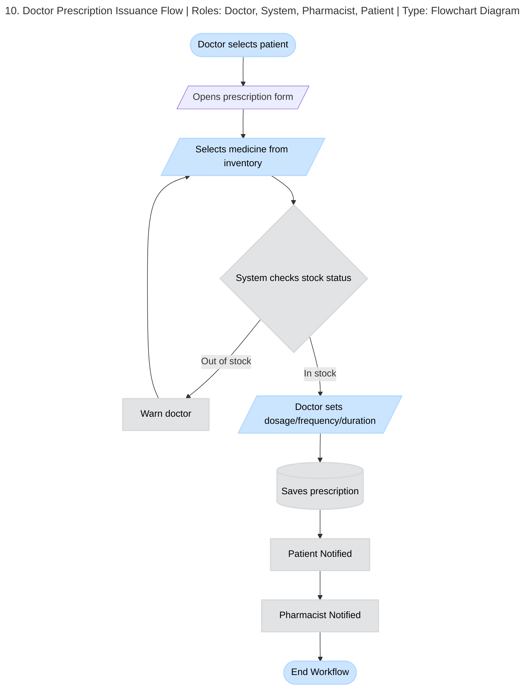
```mermaid
---
title: "10. Doctor Prescription Issuance Flow | Roles: Doctor, System, Pharmacist, Patient | Type: Flowchart Diagram"
---
flowchart TD
    classDef doctor fill:#cce5ff,stroke:#b8daff,stroke-width:2px,color:#000;
    classDef pharmacist fill:#e2d9f3,stroke:#cbbce5,stroke-width:2px,color:#000;
    classDef patient fill:#ffe5cc,stroke:#ffcc99,stroke-width:2px,color:#000;
    classDef sys fill:#e2e3e5,stroke:#d6d8db,stroke-width:2px,color:#000;

    Start([Doctor selects patient]):::doctor --> OpenUI[/Opens prescription form/]
    OpenUI --> SelMed[/Selects medicine from inventory/]:::doctor
    
    SelMed --> ChkStock{System checks stock status}:::sys
    
    ChkStock -->|Out of stock| Warn[Warn doctor]:::sys
    Warn --> SelMed
    
    ChkStock -->|In stock| Fill[/Doctor sets dosage/frequency/duration/]:::doctor
    Fill --> Save[(Saves prescription)]:::sys
    
    Save --> NotifPat[Patient Notified]:::sys
    NotifPat --> NotifPharm[Pharmacist Notified]:::sys
    NotifPharm --> EndNode([End Workflow]):::doctor
```

---

## 11. Doctor - Lab Test Request Flow
**Roles Involved:** Doctor, System, Lab Technician, Patient
**Type:** Flowchart Diagram

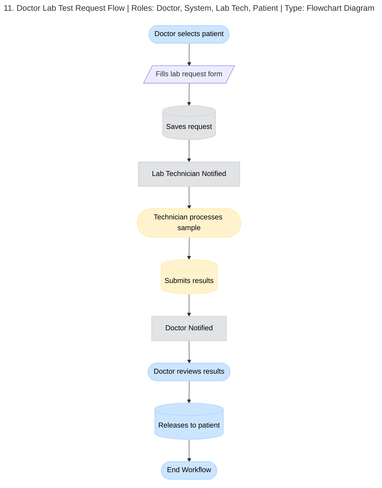
```mermaid
---
title: "11. Doctor Lab Test Request Flow | Roles: Doctor, System, Lab Tech, Patient | Type: Flowchart Diagram"
---
flowchart TD
    classDef doctor fill:#cce5ff,stroke:#b8daff,stroke-width:2px,color:#000;
    classDef lab fill:#fff3cd,stroke:#ffeeba,stroke-width:2px,color:#000;
    classDef patient fill:#ffe5cc,stroke:#ffcc99,stroke-width:2px,color:#000;
    classDef sys fill:#e2e3e5,stroke:#d6d8db,stroke-width:2px,color:#000;

    Start([Doctor selects patient]):::doctor --> FillReq[/Fills lab request form/]
    FillReq --> Save[(Saves request)]:::sys
    
    Save --> NotifLab[Lab Technician Notified]:::sys
    NotifLab --> LabProc([Technician processes sample]):::lab
    LabProc --> LabSub[(Submits results)]:::lab
    
    LabSub --> NotifDoc[Doctor Notified]:::sys
    NotifDoc --> DocRev([Doctor reviews results]):::doctor
    DocRev --> DocRel[(Releases to patient)]:::doctor
    
    DocRel --> EndNode([End Workflow]):::doctor
```

---

## 12. Administrator - Staff Approval Flow
**Roles Involved:** Administrator, System, Pending Staff
**Type:** Flowchart Diagram

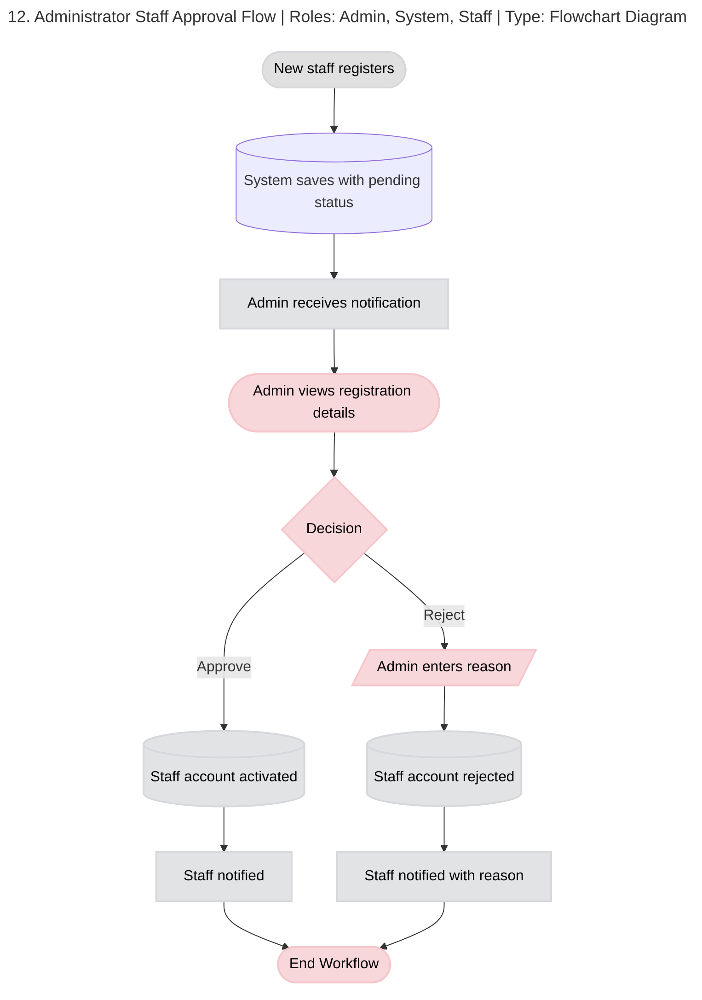
```mermaid
---
title: "12. Administrator Staff Approval Flow | Roles: Admin, System, Staff | Type: Flowchart Diagram"
---
flowchart TD
    classDef admin fill:#f8d7da,stroke:#f5c6cb,stroke-width:2px,color:#000;
    classDef staff fill:#e0e0e0,stroke:#d6d8db,stroke-width:2px,color:#000;
    classDef sys fill:#e2e3e5,stroke:#d6d8db,stroke-width:2px,color:#000;

    Start([New staff registers]):::staff --> Pending[(System saves with pending status)]
    Pending --> Notif[Admin receives notification]:::sys
    Notif --> Rev([Admin views registration details]):::admin
    
    Rev --> Decision{Decision}:::admin
    
    Decision -->|Approve| ActAppr[(Staff account activated)]:::sys
    ActAppr --> NotifStaffA[Staff notified]:::sys
    NotifStaffA --> EndNode([End Workflow]):::admin
    
    Decision -->|Reject| OptRej[/Admin enters reason/]:::admin
    OptRej --> ActRej[(Staff account rejected)]:::sys
    ActRej --> NotifStaffR[Staff notified with reason]:::sys
    NotifStaffR --> EndNode
```

---

## 13. Administrator - Task Assignment Flow
**Roles Involved:** Administrator, System, Selected Staff
**Type:** Flowchart Diagram

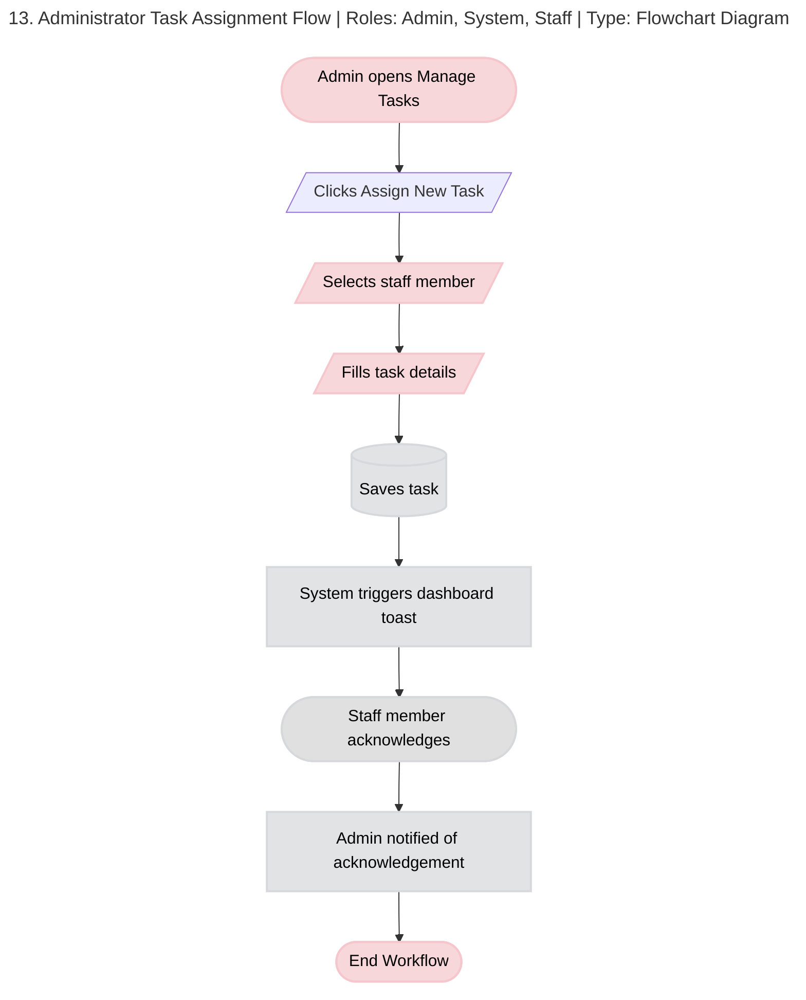
```mermaid
---
title: "13. Administrator Task Assignment Flow | Roles: Admin, System, Staff | Type: Flowchart Diagram"
---
flowchart TD
    classDef admin fill:#f8d7da,stroke:#f5c6cb,stroke-width:2px,color:#000;
    classDef staff fill:#e0e0e0,stroke:#d6d8db,stroke-width:2px,color:#000;
    classDef sys fill:#e2e3e5,stroke:#d6d8db,stroke-width:2px,color:#000;

    Start([Admin opens Manage Tasks]):::admin --> Click[/Clicks Assign New Task/]
    Click --> SelStaff[/Selects staff member/]:::admin
    SelStaff --> FillTask[/Fills task details/]:::admin
    
    FillTask --> Save[(Saves task)]:::sys
    Save --> NotifDash[System triggers dashboard toast]:::sys
    
    NotifDash --> StaffAck([Staff member acknowledges]):::staff
    StaffAck --> NotifAdmin[Admin notified of acknowledgement]:::sys
    
    NotifAdmin --> EndNode([End Workflow]):::admin
```

---

## 14. Administrator - Broadcast Message Flow
**Roles Involved:** Administrator, System
**Type:** Flowchart Diagram

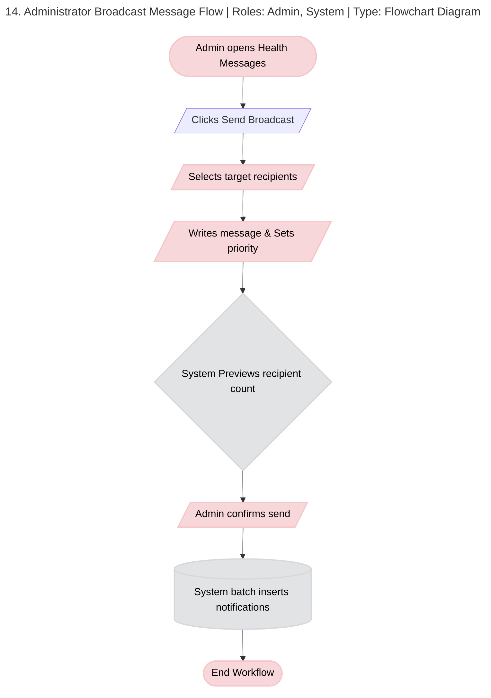
```mermaid
---
title: "14. Administrator Broadcast Message Flow | Roles: Admin, System | Type: Flowchart Diagram"
---
flowchart TD
    classDef admin fill:#f8d7da,stroke:#f5c6cb,stroke-width:2px,color:#000;
    classDef sys fill:#e2e3e5,stroke:#d6d8db,stroke-width:2px,color:#000;

    Start([Admin opens Health Messages]):::admin --> Click[/Clicks Send Broadcast/]
    Click --> SelRec[/Selects target recipients/]:::admin
    SelRec --> FillMsg[/Writes message & Sets priority/]:::admin
    
    FillMsg --> Prev{System Previews recipient count}:::sys
    Prev --> Conf[/Admin confirms send/]:::admin
    
    Conf --> PushDB[(System batch inserts notifications)]:::sys
    PushDB --> EndNode([End Workflow]):::admin
```

---

## 15. Pharmacist - Prescription Dispensing Flow
**Roles Involved:** Pharmacist, System, Patient, Doctor
**Type:** Flowchart Diagram

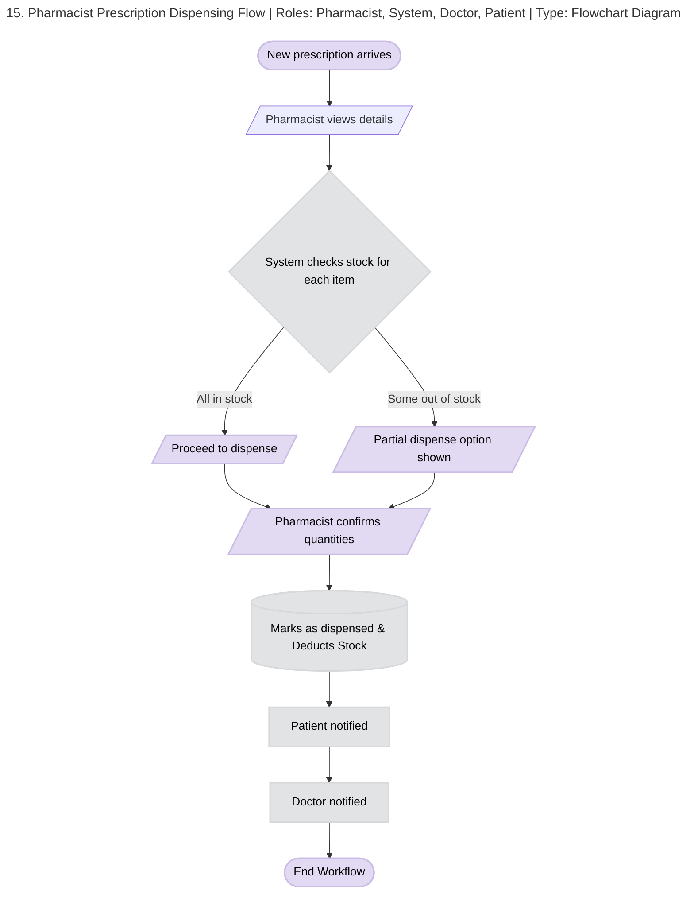
```mermaid
---
title: "15. Pharmacist Prescription Dispensing Flow | Roles: Pharmacist, System, Doctor, Patient | Type: Flowchart Diagram"
---
flowchart TD
    classDef doctor fill:#cce5ff,stroke:#b8daff,stroke-width:2px,color:#000;
    classDef pharmacist fill:#e2d9f3,stroke:#cbbce5,stroke-width:2px,color:#000;
    classDef patient fill:#ffe5cc,stroke:#ffcc99,stroke-width:2px,color:#000;
    classDef sys fill:#e2e3e5,stroke:#d6d8db,stroke-width:2px,color:#000;

    Start([New prescription arrives]):::pharmacist --> View[/Pharmacist views details/]
    View --> SysCheck{System checks stock for each item}:::sys
    
    SysCheck -->|All in stock| Dispense[/Proceed to dispense/]:::pharmacist
    SysCheck -->|Some out of stock| Partial[/Partial dispense option shown/]:::pharmacist
    
    Dispense --> Conf[/Pharmacist confirms quantities/]:::pharmacist
    Partial --> Conf
    
    Conf --> MarkDB[(Marks as dispensed & Deducts Stock)]:::sys
    MarkDB --> NotifPat[Patient notified]:::sys
    NotifPat --> NotifDoc[Doctor notified]:::sys
    NotifDoc --> EndNode([End Workflow]):::pharmacist
```

---

## 16. Pharmacist - Low Stock Alert Flow
**Roles Involved:** System, Pharmacist, Administrator
**Type:** Flowchart Diagram

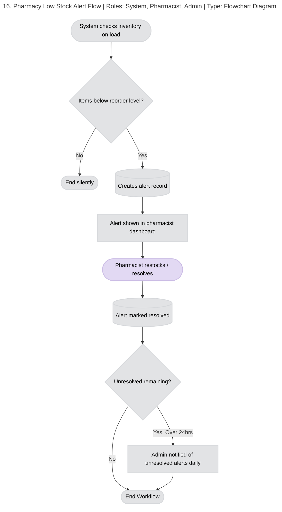
```mermaid
---
title: "16. Pharmacy Low Stock Alert Flow | Roles: System, Pharmacist, Admin | Type: Flowchart Diagram"
---
flowchart TD
    classDef admin fill:#f8d7da,stroke:#f5c6cb,stroke-width:2px,color:#000;
    classDef pharmacist fill:#e2d9f3,stroke:#cbbce5,stroke-width:2px,color:#000;
    classDef sys fill:#e2e3e5,stroke:#d6d8db,stroke-width:2px,color:#000;

    Start([System checks inventory on load]):::sys --> Ident{Items below reorder level?}:::sys
    
    Ident -->|No| End1([End silently]):::sys
    
    Ident -->|Yes| Create[(Creates alert record)]:::sys
    Create --> ViewAlert[Alert shown in pharmacist dashboard]:::sys
    
    ViewAlert --> Resolve([Pharmacist restocks / resolves]):::pharmacist
    Resolve --> MarkDB[(Alert marked resolved)]:::sys
    
    MarkDB --> Unres{Unresolved remaining?}:::sys
    Unres -->|No| End2([End Workflow]):::sys
    Unres -->|Yes, Over 24hrs| NotifAdm[Admin notified of unresolved alerts daily]:::sys
    NotifAdm --> End2
```

---

## 17. Lab Technician - Test Order Processing Flow
**Roles Involved:** Lab Technician, System, Doctor
**Type:** Flowchart Diagram

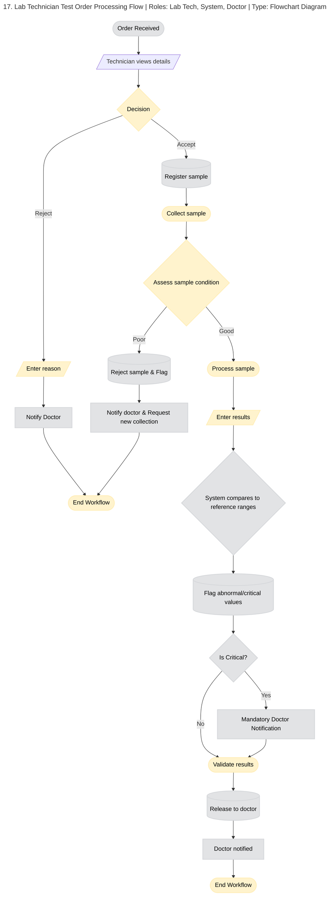
```mermaid
---
title: "17. Lab Technician Test Order Processing Flow | Roles: Lab Tech, System, Doctor | Type: Flowchart Diagram"
---
flowchart TD
    classDef doctor fill:#cce5ff,stroke:#b8daff,stroke-width:2px,color:#000;
    classDef lab fill:#fff3cd,stroke:#ffeeba,stroke-width:2px,color:#000;
    classDef sys fill:#e2e3e5,stroke:#d6d8db,stroke-width:2px,color:#000;

    Start([Order Received]):::sys --> View[/Technician views details/]
    
    View --> DecAcc{Decision}:::lab
    
    DecAcc -->|Reject| OptRej[/Enter reason/]:::lab
    OptRej --> NotifRej[Notify Doctor]:::sys
    NotifRej --> EndReject([End Workflow]):::lab
    
    DecAcc -->|Accept| RegSamp[(Register sample)]:::sys
    RegSamp --> Collect([Collect sample]):::lab
    Collect --> Assess{Assess sample condition}:::lab
    
    Assess -->|Poor| FlagRej[(Reject sample & Flag)]:::sys
    FlagRej --> NotifDoc[Notify doctor & Request new collection]:::sys
    NotifDoc --> EndReject
    
    Assess -->|Good| Proc([Process sample]):::lab
    Proc --> EnterRes[/Enter results/]:::lab
    
    EnterRes --> SysComp{System compares to reference ranges}:::sys
    SysComp --> FlagAbn[(Flag abnormal/critical values)]:::sys
    
    FlagAbn --> IsCrit{Is Critical?}:::sys
    IsCrit -->|Yes| AlertDoc[Mandatory Doctor Notification]:::sys
    IsCrit -->|No| ValRes([Validate results]):::lab
    AlertDoc --> ValRes
    
    ValRes --> RelRes[(Release to doctor)]:::sys
    RelRes --> NotifRel[Doctor notified]:::sys
    NotifRel --> EndAcc([End Workflow]):::lab
```

---

## 18. Lab Technician - Equipment Calibration Flow
**Roles Involved:** Lab Technician, System, Administrator
**Type:** Flowchart Diagram

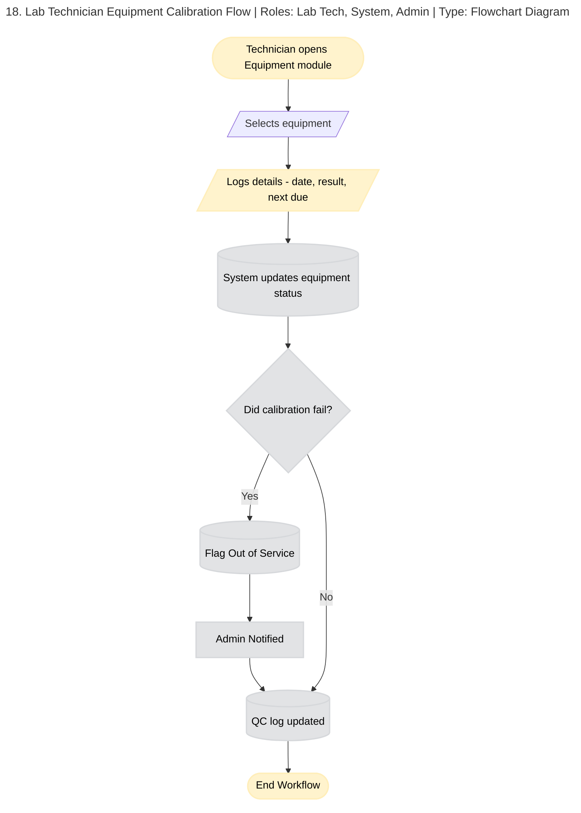
```mermaid
---
title: "18. Lab Technician Equipment Calibration Flow | Roles: Lab Tech, System, Admin | Type: Flowchart Diagram"
---
flowchart TD
    classDef admin fill:#f8d7da,stroke:#f5c6cb,stroke-width:2px,color:#000;
    classDef lab fill:#fff3cd,stroke:#ffeeba,stroke-width:2px,color:#000;
    classDef sys fill:#e2e3e5,stroke:#d6d8db,stroke-width:2px,color:#000;

    Start([Technician opens Equipment module]):::lab --> SelEq[/Selects equipment/]
    SelEq --> LogCal[/Logs details - date, result, next due/]:::lab
    
    LogCal --> SaveDB[(System updates equipment status)]:::sys
    
    SaveDB --> ChkFail{Did calibration fail?}:::sys
    
    ChkFail -->|Yes| FlagOut[(Flag Out of Service)]:::sys
    FlagOut --> NotifAdm[Admin Notified]:::sys
    NotifAdm --> LogQC[(QC log updated)]:::sys
    
    ChkFail -->|No| LogQC
    LogQC --> EndNode([End Workflow]):::lab
```

---

## 19. Nurse - Vital Signs Recording Flow
**Roles Involved:** Nurse, System, Doctor
**Type:** Flowchart Diagram

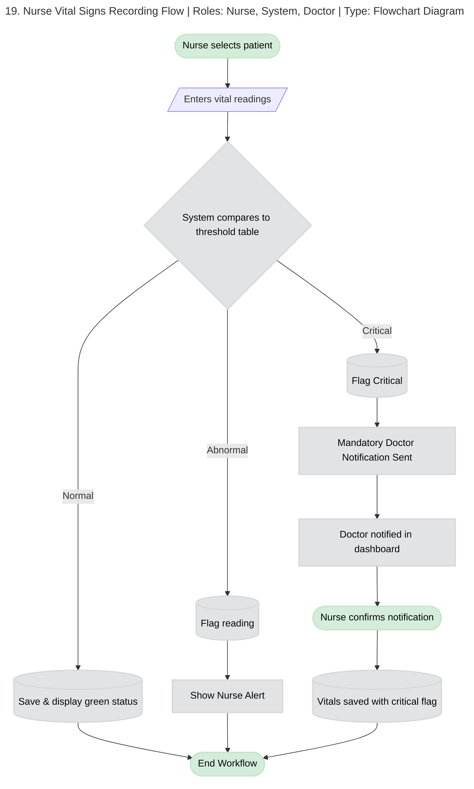
```mermaid
---
title: "19. Nurse Vital Signs Recording Flow | Roles: Nurse, System, Doctor | Type: Flowchart Diagram"
---
flowchart TD
    classDef doctor fill:#cce5ff,stroke:#b8daff,stroke-width:2px,color:#000;
    classDef nurse fill:#d4edda,stroke:#c3e6cb,stroke-width:2px,color:#000;
    classDef sys fill:#e2e3e5,stroke:#d6d8db,stroke-width:2px,color:#000;

    Start([Nurse selects patient]):::nurse --> Enter[/Enters vital readings/]
    Enter --> SysComp{System compares to threshold table}:::sys
    
    SysComp -->|Normal| SaveN[(Save & display green status)]:::sys
    SaveN --> EndNode([End Workflow]):::nurse
    
    SysComp -->|Abnormal| Flag[(Flag reading)]:::sys
    Flag --> ShowAlert[Show Nurse Alert]:::sys
    ShowAlert --> EndNode
    
    SysComp -->|Critical| FlagCrit[(Flag Critical)]:::sys
    FlagCrit --> NotifDoc[Mandatory Doctor Notification Sent]:::sys
    NotifDoc --> DocDash[Doctor notified in dashboard]:::sys
    DocDash --> NurConf([Nurse confirms notification]):::nurse
    NurConf --> SaveC[(Vitals saved with critical flag)]:::sys
    SaveC --> EndNode
```

---

## 20. Nurse - Shift Handover Flow
**Roles Involved:** Off-going Nurse, System, Incoming Nurse
**Type:** Flowchart Diagram

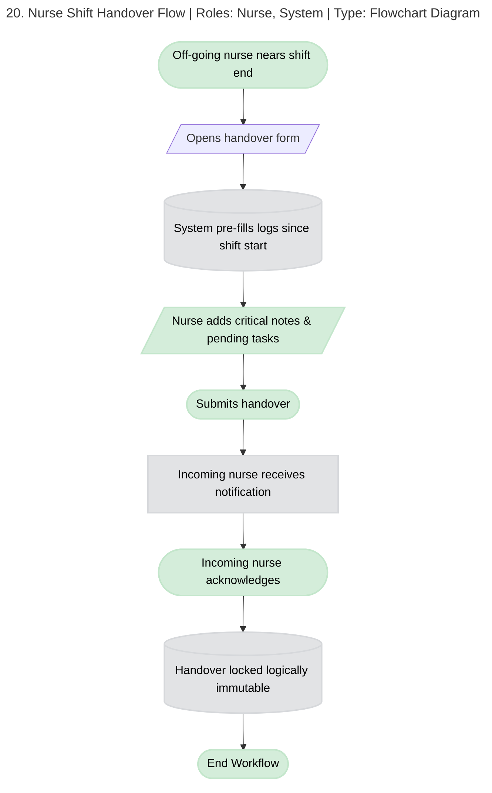
```mermaid
---
title: "20. Nurse Shift Handover Flow | Roles: Nurse, System | Type: Flowchart Diagram"
---
flowchart TD
    classDef nurse fill:#d4edda,stroke:#c3e6cb,stroke-width:2px,color:#000;
    classDef sys fill:#e2e3e5,stroke:#d6d8db,stroke-width:2px,color:#000;

    Start([Off-going nurse nears shift end]):::nurse --> Open[/Opens handover form/]
    
    Open --> PreFill[(System pre-fills logs since shift start)]:::sys
    
    PreFill --> AddNotes[/Nurse adds critical notes & pending tasks/]:::nurse
    AddNotes --> Submit([Submits handover]):::nurse
    
    Submit --> NotifInc[Incoming nurse receives notification]:::sys
    NotifInc --> AckInc([Incoming nurse acknowledges]):::nurse
    
    AckInc --> Lock[(Handover locked logically immutable)]:::sys
    Lock --> EndNode([End Workflow]):::nurse
```

---

## 21. Nurse - Emergency Alert Flow (Code Blue)
**Roles Involved:** Nurse, System, Doctor, Administrator
**Type:** Flowchart Diagram

```mermaid
---
title: "21. Nurse Emergency Alert Flow | Roles: Nurse, System, Doctor, Admin | Type: Flowchart Diagram"
---
flowchart TD
    classDef admin fill:#f8d7da,stroke:#f5c6cb,stroke-width:2px,color:#000;
    classDef doctor fill:#cce5ff,stroke:#b8daff,stroke-width:2px,color:#000;
    classDef nurse fill:#d4edda,stroke:#c3e6cb,stroke-width:2px,color:#000;
    classDef sys fill:#e2e3e5,stroke:#d6d8db,stroke-width:2px,color:#000;

    Start([Nurse clicks Emergency Alert]):::nurse --> SelType[/Selects alert type/]
    SelType --> ConfPat[/Confirms patient & location/]:::nurse
    
    ConfPat --> Broad[(System broadcasts simultaneously)]:::sys
    
    Broad --> NotifDoc[Notifies all available Doctors]:::sys
    Broad --> NotifAdm[Notifies Admin]:::sys
    
    Broad --> LogDB[(Alert logged in DB)]:::sys
    LogDB --> Timer[Emergency Timer Starts]:::sys
    
    NotifDoc --> DocResp([Doctor responds / acknowledges]):::doctor
    DocResp --> UpdStat[(Status updated)]:::sys
    
    UpdStat --> NurSee[Nurse sees response confirmation]:::sys
    Res --> EndNode([End Workflow]):::nurse
```

---

## 22. Ambulance Driver - Trip Dispatch Flow
**Roles Involved:** Driver, System, Admin
**Type:** Flowchart Diagram

```mermaid
---
title: "22. Ambulance Driver Trip Dispatch Flow | Roles: Driver, System, Admin | Type: Flowchart Diagram"
---
flowchart TD
    classDef admin fill:#f8d7da,stroke:#f5c6cb,stroke-width:2px,color:#000;
    classDef support fill:#e0e0e0,stroke:#d6d8db,stroke-width:2px,color:#000;
    classDef sys fill:#e2e3e5,stroke:#d6d8db,stroke-width:2px,color:#000;

    Start([Driver logs in]):::support --> ViewP[/Views pending requests/]
    ViewP --> ReqArr{Request arrives}:::sys
    
    ReqArr --> Acc([Driver accepts]):::support
    Acc --> StatEn[(Status - En Route)]:::sys
    
    StatEn --> ArrP([Arrives at pickup]):::support
    ArrP --> StatOn[(Status - Patient Onboard)]:::sys
    
    StatOn --> ArrH([Arrives at hospital]):::support
    ArrH --> StatArr[(Status - Arrived)]:::sys
    
    StatArr --> TripC([Trip completed]):::support
    TripC --> LogF[/Logs fuel used/]:::support
    
    LogF --> StatAvail[(Driver Status - Available)]:::sys
    StatAvail --> Notif[Admin & Requestor notified]:::sys
    Notif --> EndNode([End Workflow]):::support
```

---

## 23. Cleaner - Cleaning Dispatch Flow
**Roles Involved:** Cleaner, System, Admin
**Type:** Flowchart Diagram

```mermaid
---
title: "23. Cleaner Dispatch Flow | Roles: Cleaner, System, Admin | Type: Flowchart Diagram"
---
flowchart TD
    classDef support fill:#e0e0e0,stroke:#d6d8db,stroke-width:2px,color:#000;
    classDef sys fill:#e2e3e5,stroke:#d6d8db,stroke-width:2px,color:#000;

    Start([Admin dispatches task]):::sys --> Notif[Cleaner Notified]
    Notif --> View[/Cleaner views task details/]:::support
    
    View --> IsBio{If Biohazard?}:::sys
    IsBio -->|Yes| ConfPPE([Confirm PPE protocol before start]):::support
    IsBio -->|No| StartT([Cleaner starts task]):::support
    ConfPPE --> StartT
    
    StartT --> CompCheck[/Completes checklist item by item/]:::support
    CompCheck --> Upl[/Uploads proof photo/]:::support
    
    Upl --> Mark([Marks task complete]):::support
    Mark --> UpdStat[(Updates sanitation status)]:::sys
    
    UpdStat --> NotifAdm[Admin notified]:::sys
    NotifAdm --> EndNode([End Workflow]):::support
```

---

## 24. Laundry Staff - Batch Processing Flow
**Roles Involved:** Laundry Staff, System
**Type:** Flowchart Diagram

```mermaid
---
title: "24. Laundry Staff Batch Processing Flow | Roles: Laundry Staff, System | Type: Flowchart Diagram"
---
flowchart TD
    classDef support fill:#e0e0e0,stroke:#d6d8db,stroke-width:2px,color:#000;
    classDef sys fill:#e2e3e5,stroke:#d6d8db,stroke-width:2px,color:#000;

    Start([Ward sends laundry request]):::sys --> Reg([Staff registers batch]
    Reg --> Code[(Assigns batch code)]:::sys
    
    Code --> Tag([Tags contaminated items]):::support
    Tag --> StatCol[(Status - Collected)]:::sys
    
    StatCol --> Wash([Washing begins]):::support
    Wash --> StatWash[(Status - Washing)]:::sys
    
    StatWash --> WashC([Washing complete]):::support
    WashC --> StatIron[(Status - Ironing)]:::sys
    
    StatIron --> IronC([Ironing complete]):::support
    IronC --> Qual([Quality Check]):::support
    
    Qual --> Damg{Damaged items?}:::support
    Damg -->|Yes| LogD[(Log damaged items)]:::sys
    Damg -->|No| StatDel[(Status - Delivered)]:::sys
    LogD --> StatDel
    
    StatDel --> Notif[Ward Notified]:::sys
    Notif --> EndNode([End Workflow]):::support
```

---

## 25. Maintenance Staff - Repair Request Flow
**Roles Involved:** Maintenance Staff, Admin, System
**Type:** Flowchart Diagram

```mermaid
---
title: "25. Maintenance Staff Repair Flow | Roles: Maintenance, Admin, System | Type: Flowchart Diagram"
---
flowchart TD
    classDef admin fill:#f8d7da,stroke:#f5c6cb,stroke-width:2px,color:#000;
    classDef support fill:#e0e0e0,stroke:#d6d8db,stroke-width:2px,color:#000;
    classDef sys fill:#e2e3e5,stroke:#d6d8db,stroke-width:2px,color:#000;

    Start([Admin reports issue]):::admin --> Notif[Maintenance staff notified]
    Notif --> View[/Views details & Accepts/]:::support
    
    View --> StatAss[(Status - Assigned)]:::sys
    StatAss --> StartRep([Starts repair]):::support
    StartRep --> StatProg[(Status - In Progress)]:::sys
    
    StatProg --> Log[/Logs repair work parts/cost/]:::support
    Log --> Upl[/Uploads completion photos/]:::support
    
    Upl --> Mark([Marks complete]):::support
    Mark --> ConfAdm([Admin verifies]):::admin
    
    ConfAdm --> StatComp[(Status - Completed)]:::sys
    StatComp --> EndNode([End Workflow]):::support
```

---

## 26. Security Officer - Incident Reporting Flow
**Roles Involved:** Security Officer, Admin, System
**Type:** Flowchart Diagram

```mermaid
---
title: "26. Security Incident Reporting Flow | Roles: Security, Admin, System | Type: Flowchart Diagram"
---
flowchart TD
    classDef admin fill:#f8d7da,stroke:#f5c6cb,stroke-width:2px,color:#000;
    classDef support fill:#e0e0e0,stroke:#d6d8db,stroke-width:2px,color:#000;
    classDef sys fill:#e2e3e5,stroke:#d6d8db,stroke-width:2px,color:#000;

    Start([Security officer observes incident]):::support --> Open[/Opens report form/]
    Open --> Fill[/Fills severity/location/details/]:::support
    Fill --> Sub[(Submits report)]:::sys
    
    Sub --> Crit{Is Critical/Escalation needed?}:::sys
    
    Crit -->|Yes| ImmNotif[Admin immediately notified]:::sys
    ImmNotif --> AdmAck([Admin acknowledges]):::admin
    AdmAck --> StatUpd[(Status updated)]:::sys
    StatUpd --> EndNode([End Workflow]):::support
    
    Crit -->|No| SaveRep[(Report saved to log silently)]:::sys
    SaveRep --> EndNode
```

---

## 27. Kitchen Staff - Meal Preparation Flow
**Roles Involved:** Kitchen Staff, System
**Type:** Flowchart Diagram

```mermaid
---
title: "27. Kitchen Meal Preparation Flow | Roles: Kitchen Staff, System | Type: Flowchart Diagram"
---
flowchart TD
    classDef support fill:#e0e0e0,stroke:#d6d8db,stroke-width:2px,color:#000;
    classDef sys fill:#e2e3e5,stroke:#d6d8db,stroke-width:2px,color:#000;

    Start([Admin assigns meal task]):::sys --> View([Kitchen staff views task]
    
    View --> ChkDiet{Checks dietary alerts}:::sys
    ChkDiet -->|Allergy Flagged| Warn[Prominent Warning Shown]:::sys
    ChkDiet -->|Normal| StartPrep
    Warn --> StartPrep([Starts preparation]):::support
    
    StartPrep --> StatPrep[(Status - In Preparation)]:::sys
    StatPrep --> Ready([Meal Ready]):::support
    
    Ready --> StatReady[(Status - Ready)]:::sys
    StatReady --> Deliver([Delivers to ward]):::support
    
    Deliver --> StatDel[(Status - Delivered)]:::sys
    StatDel --> Notif[Ward Nurse Notified]:::sys
    Notif --> EndNode([End Workflow]):::support
```
