# RMU Medical Sickbay System - Sequence Diagrams

This document contains standardized sequence diagrams showing the chronological interactions, lifelines, message passing, and module activations across different roles within the RMU Medical Sickbay System. 

## Conventions & Legends
- **Actors/Participants:** Declared at the top.
- **Activation Bars:** Indicated by vertical rectangles on lifelines (`+` / `-`).
- **Messages:** Solid arrows for requests/actions (`->>`). Dashed arrows for returns/callbacks (`-->>`).
- **Fragments:** Uses `alt` (alternative/if-else) and `opt` (optional paths).
- **Role Color Coding:** Enforced using categorized bounding boxes.
  - Admin: `Red` (`rgb(248, 215, 218)`)
  - Doctor: `Blue` (`rgb(204, 229, 255)`)
  - Nurse: `Green` (`rgb(212, 237, 218)`)
  - Pharmacist: `Purple` (`rgb(226, 217, 243)`)
  - Lab Technician: `Yellow` (`rgb(255, 243, 205)`)
  - Patient: `Orange` (`rgb(255, 229, 204)`)
  - System/DB: `Gray` (`rgb(226, 227, 229)`)

---

## 1. Patient Appointment Booking & Confirmation
**Roles Involved:** Patient, System (Web+DB), Email Service, Doctor
**Type:** Sequence Diagram

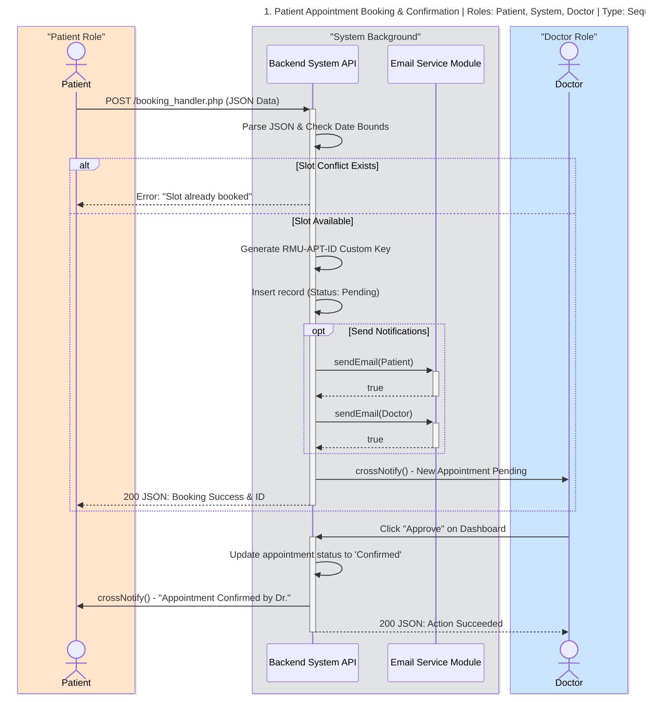

---

## 2. Lab Test Lifecycle & Result Release
**Roles Involved:** Doctor, System (DB Dual Write), Lab Technician, Patient
**Type:** Sequence Diagram

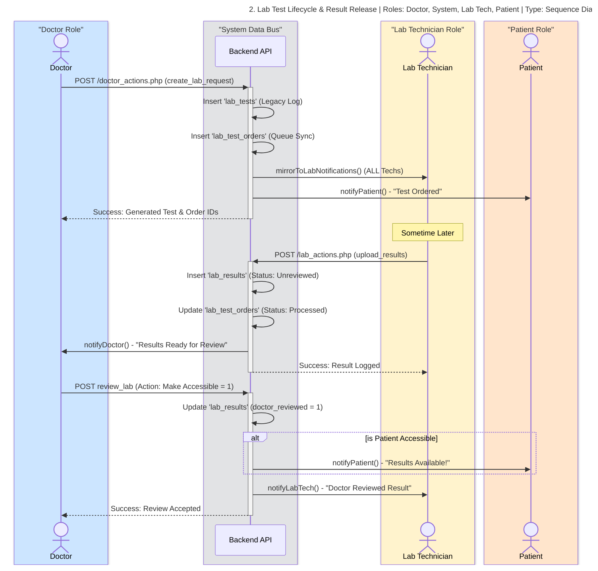

---

## 3. Pharmacy Dispensing & Alert Escalation
**Roles Involved:** Pharmacist, System, Patient, Doctor, Admin
**Type:** Sequence Diagram

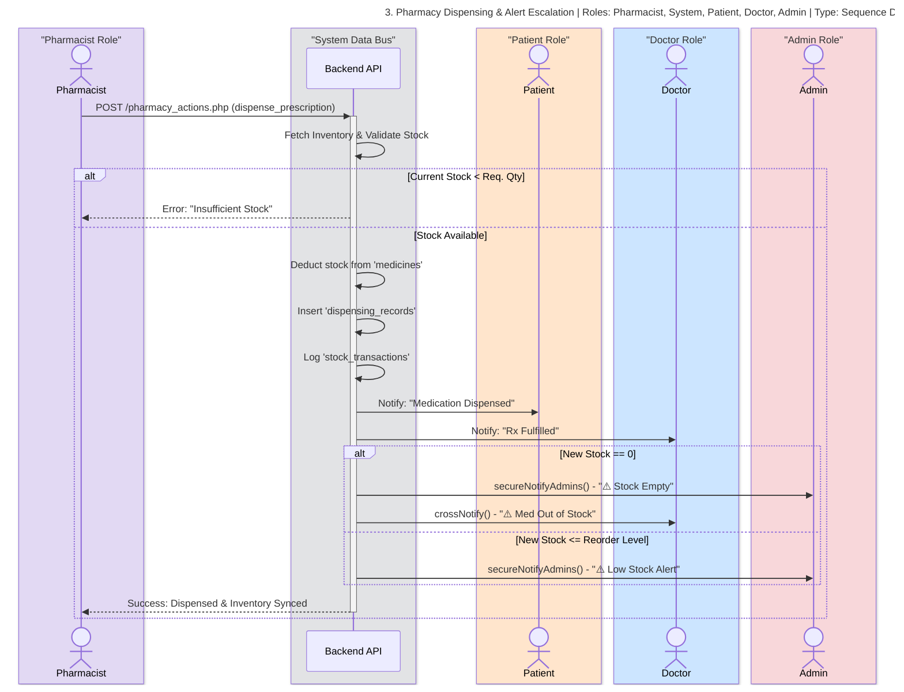

---

## 4. Patient - Appointment Booking Sequence
**Roles Involved:** Patient, UI, System/Server, DB, Notification Service
**Type:** Sequence Diagram

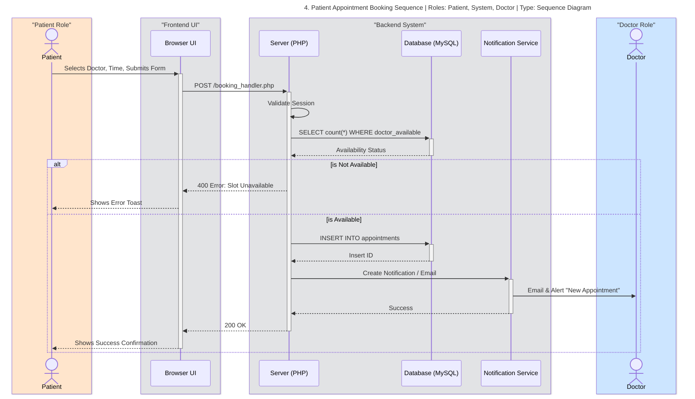

---

## 5. Patient - Lab Result Access Sequence
**Roles Involved:** Patient, UI, System/Server, DB
**Type:** Sequence Diagram

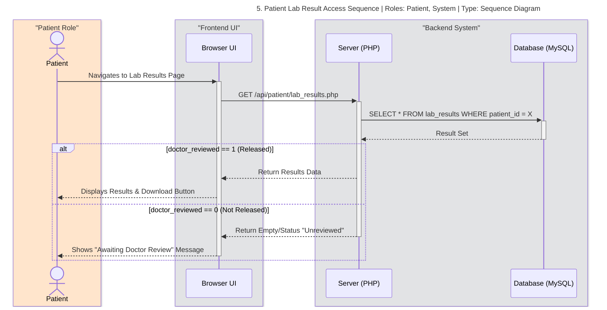

---

## 6. Doctor - Prescription Issuance Sequence
**Roles Involved:** Doctor, UI, Server, DB, Notification Service, Pharmacist, Patient
**Type:** Sequence Diagram

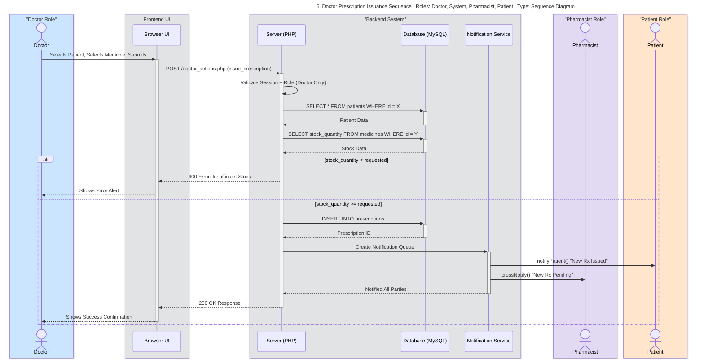

---

## 7. Doctor - Lab Result Release Sequence
**Roles Involved:** Doctor, UI, Server, DB, Notification Service, Patient
**Type:** Sequence Diagram

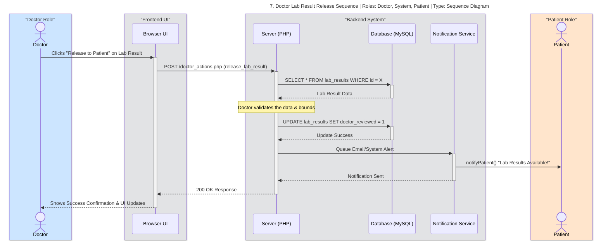

---

## 8. Administrator - Staff Account Approval Sequence
**Roles Involved:** Administrator, UI, Server, DB, Notification Service, Pending Staff
**Type:** Sequence Diagram

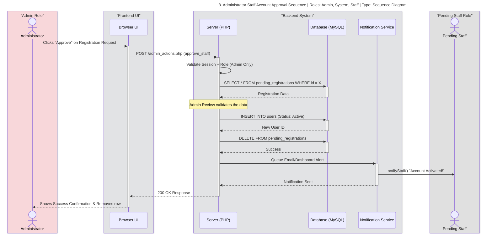

---

## 9. Administrator - System Broadcast Sequence
**Roles Involved:** Administrator, UI, Server, DB, Notification Service
**Type:** Sequence Diagram

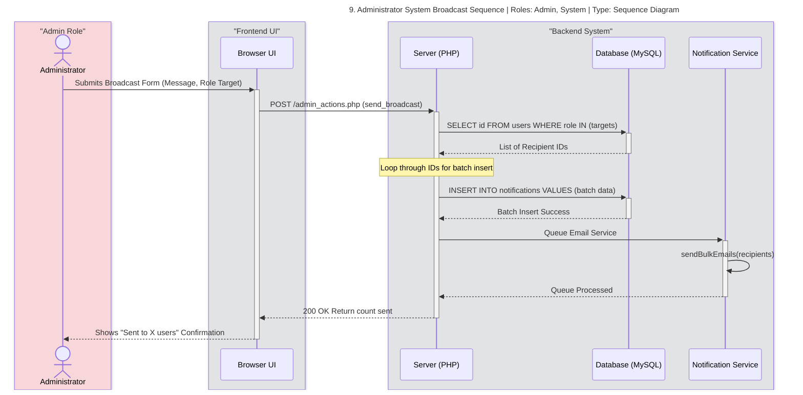

---

## 10. Pharmacist - Prescription Dispensing Sequence
**Roles Involved:** Pharmacist, UI, Server, DB, Notification Service, Doctor, Patient
**Type:** Sequence Diagram

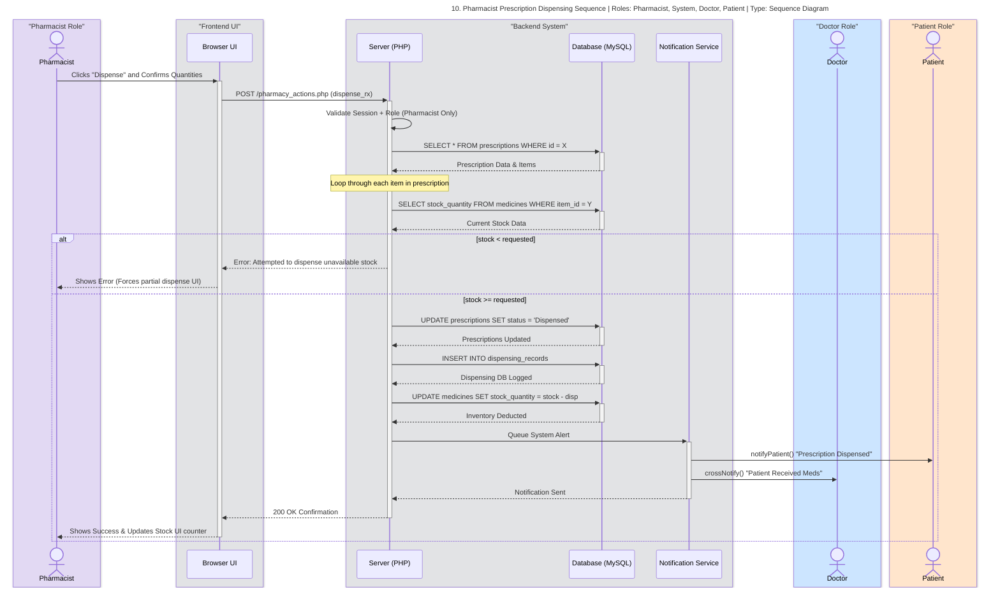

---

## 11. Lab Technician - Lab Result Entry & Release Sequence
**Roles Involved:** Lab Technician, UI, Server, DB, Notification Service, Doctor
**Type:** Sequence Diagram

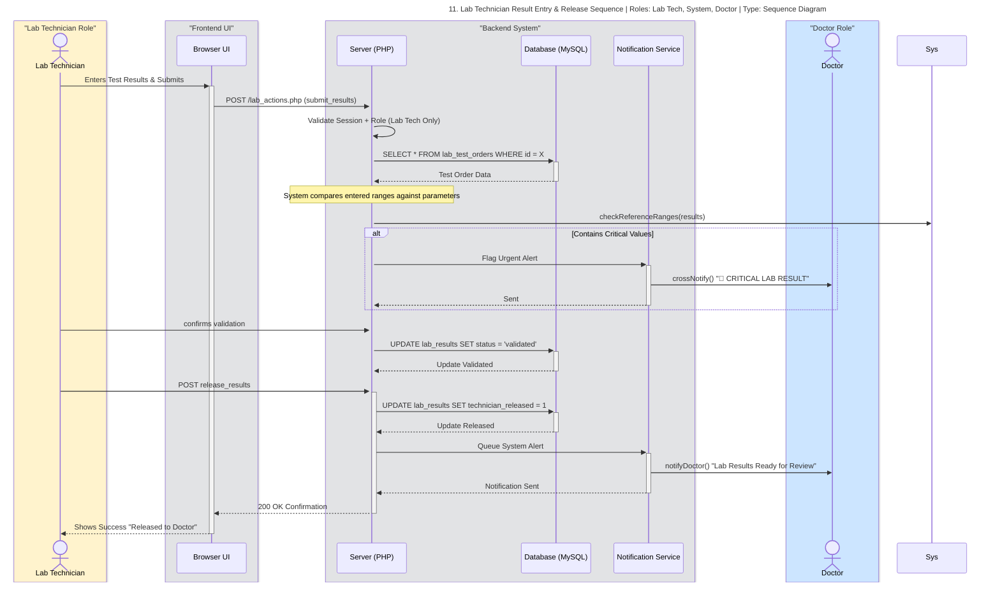

---

## 12. Nurse - Critical Vital Alert Sequence
**Roles Involved:** Nurse, UI, Server, DB, Notification Service, Doctor
**Type:** Sequence Diagram

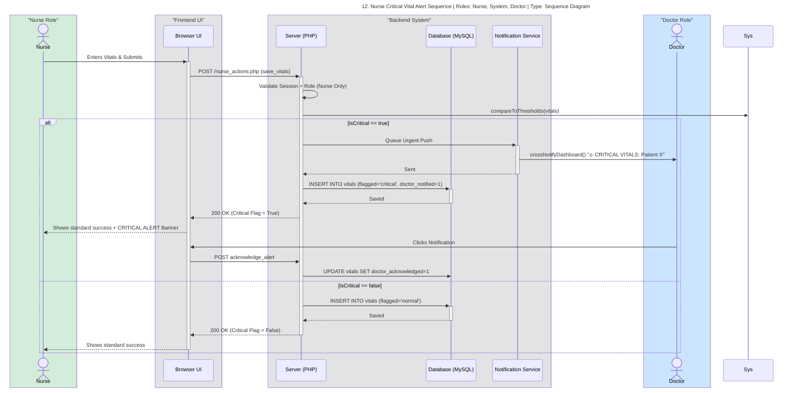

---

## 13. Nurse - Emergency Alert Sequence (Code Blue)
**Roles Involved:** Nurse, UI, Server, DB, Notification Service, Doctor, Admin
**Type:** Sequence Diagram

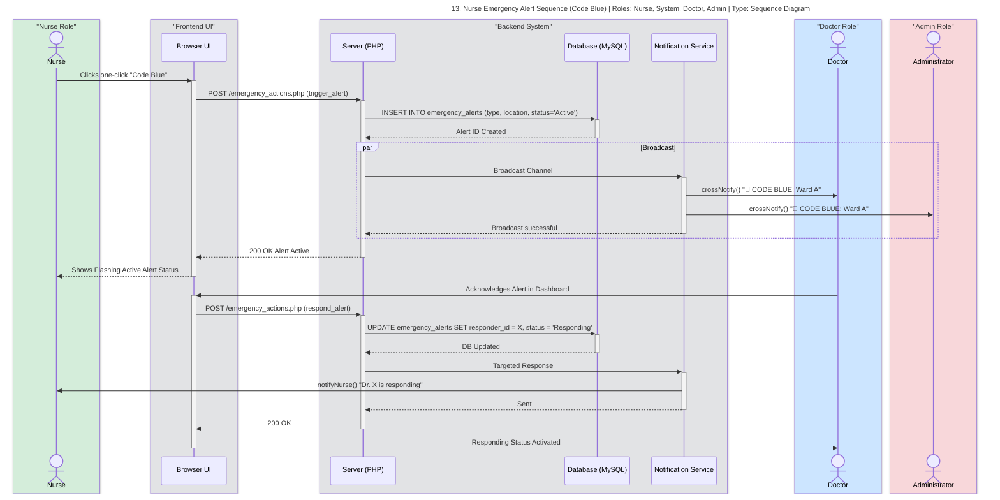

---

## 14. Support Staff - Ambulance Dispatch Sequence
**Roles Involved:** Administrator, Support Staff (Driver), UI, Server, DB, Notification Service
**Type:** Sequence Diagram

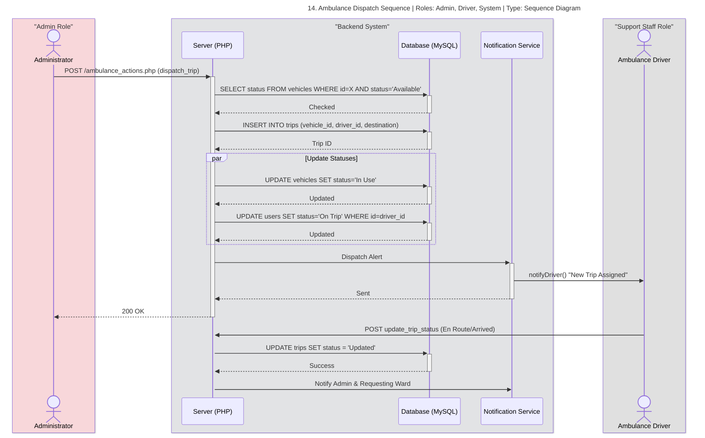

---

## 15. Support Staff - Cleaning Dispatch Sequence
**Roles Involved:** Administrator, Support Staff (Cleaner), UI, Server, DB, Notification Service
**Type:** Sequence Diagram

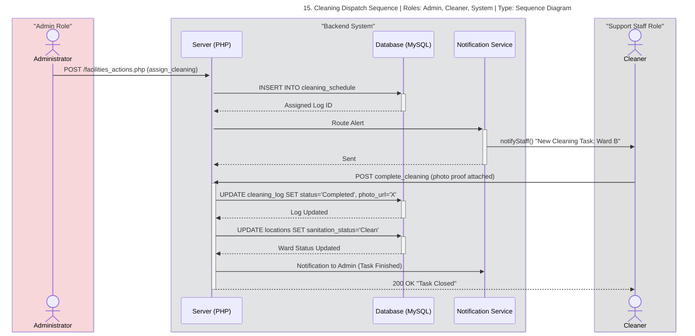

---

## 16. Support Staff - Maintenance Request Sequence
**Roles Involved:** Any User, Support Staff (Maintenance), Server, DB, Notification Service, Admin
**Type:** Sequence Diagram

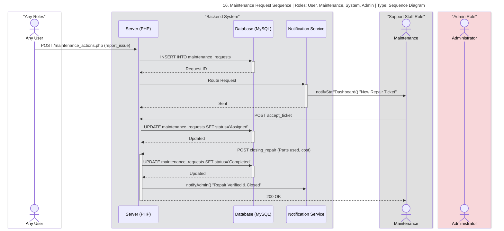
