# RMU Medical Sickbay System - Use Case Diagrams

This document contains the structural Use Case Diagrams mapping the interactions between actors and the RMU Medical Sickbay System. The diagrams follow standard UML-like notation mapped within Mermaid `flowchart LR` structures.

## Conventions & Legends
- **System Boundary:** `RMU Medical Sickbay System` bounds the internal use cases.
- **Primary Actors:** Represented on the **Left** with FontAwesome user icons.
- **Secondary Actors:** Represented on the **Right**.
- **Use Cases:** Oval shapes with `Verb + Noun` actions.
- **Relationships:** Solid lines for interactions, dashed lines with `include` or `extend`.
- **Role Color Coding:**
  - Admin: `Red`
  - Doctor: `Blue`
  - Nurse: `Green`
  - Pharmacist: `Purple`
  - Lab Technician: `Yellow`
  - Patient: `Orange`
  - System/DB: `Gray`

---

## 1. Appointment & Patient Management
**Roles:** Patient, Doctor, Admin, System DB
**Type:** Use Case Diagram

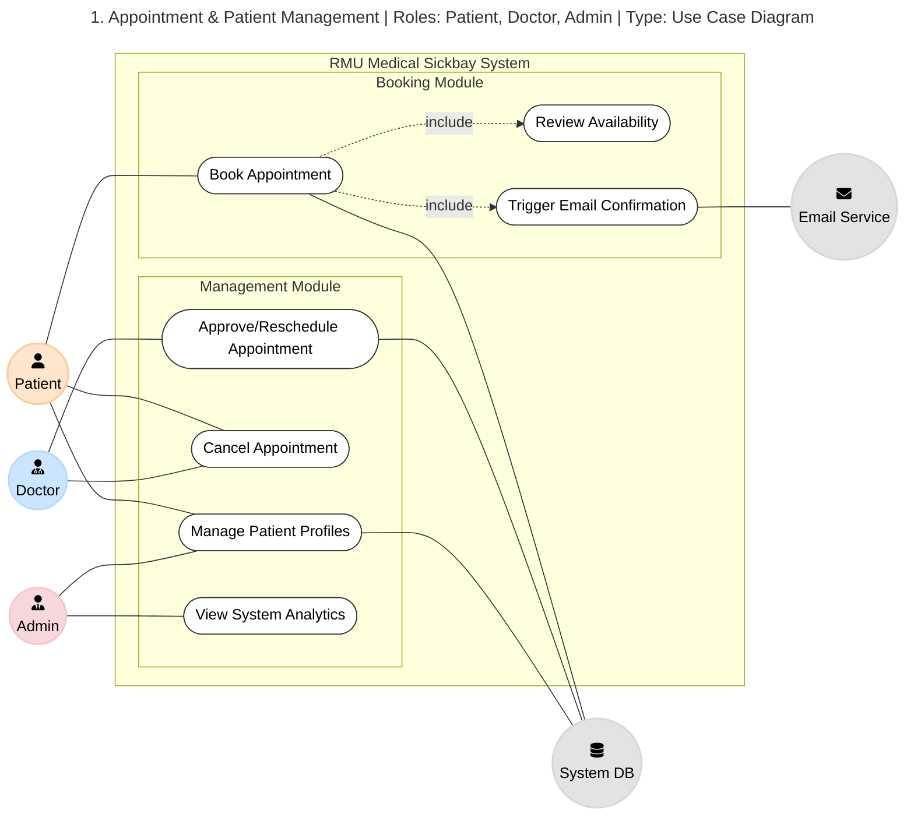

---

## 2. Clinical Consultation & Prescriptions
**Roles:** Doctor, Nurse, Pharmacist, Patient
**Type:** Use Case Diagram

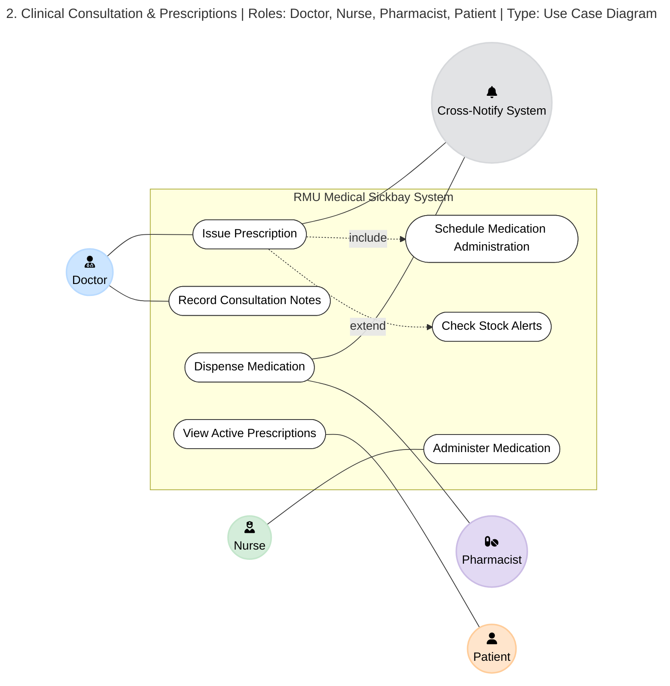

---

## 3. Laboratory Management Flow
**Roles:** Doctor, Lab Technician, Patient
**Type:** Use Case Diagram

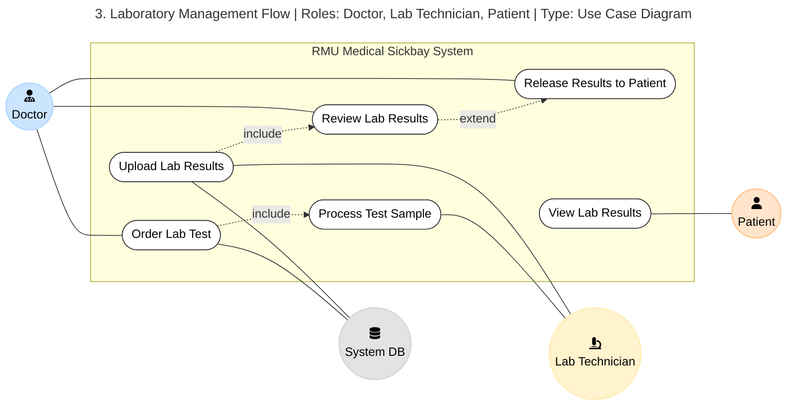

---

## 4. Ward & Emergency Management
**Roles:** Nurse, Doctor, Admin
**Type:** Use Case Diagram

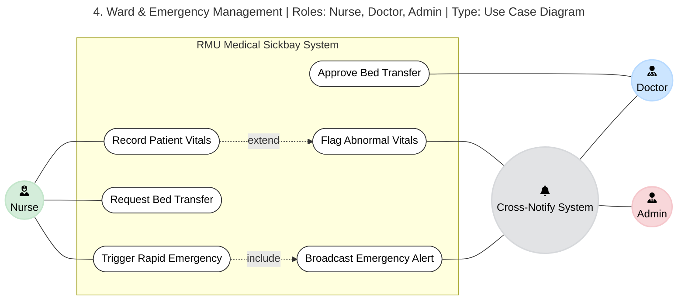

---

## 5. Patient Complete System Interactions
**Roles:** Patient, Doctor, Lab Technician, System Notification
**Type:** Use Case Diagram

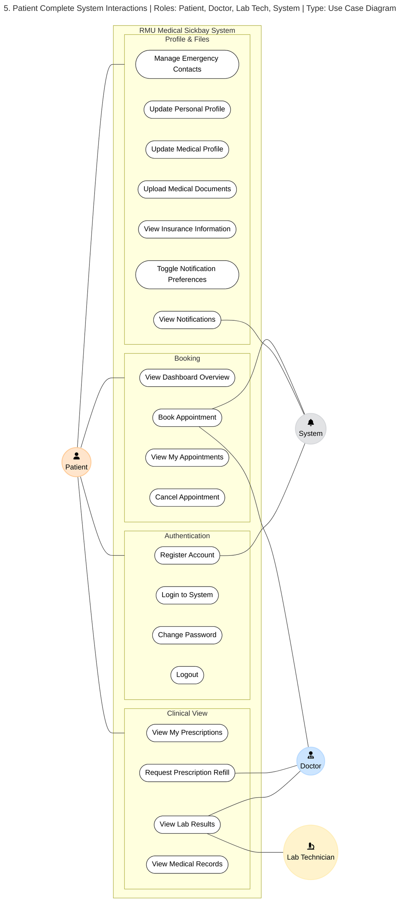

---

## 6. Doctor Complete System Interactions
**Roles:** Doctor, Patient, Nurse, Lab Technician, Pharmacist, System
**Type:** Use Case Diagram

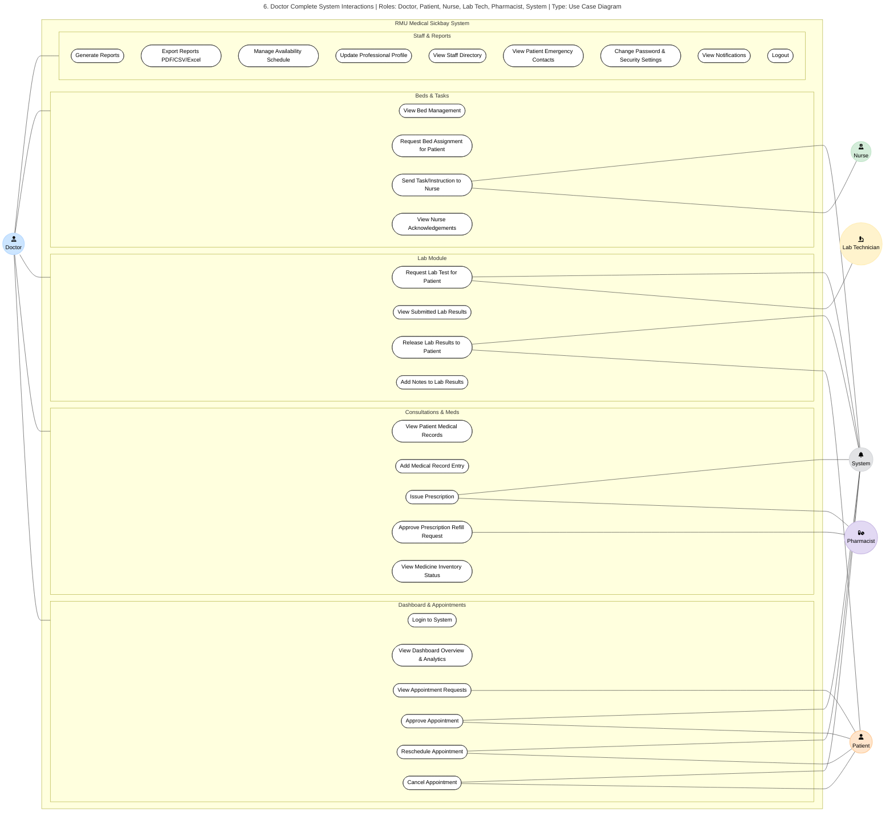

---

## 7. Administrator Complete System Management
**Roles:** Administrator, System
**Type:** Use Case Diagram

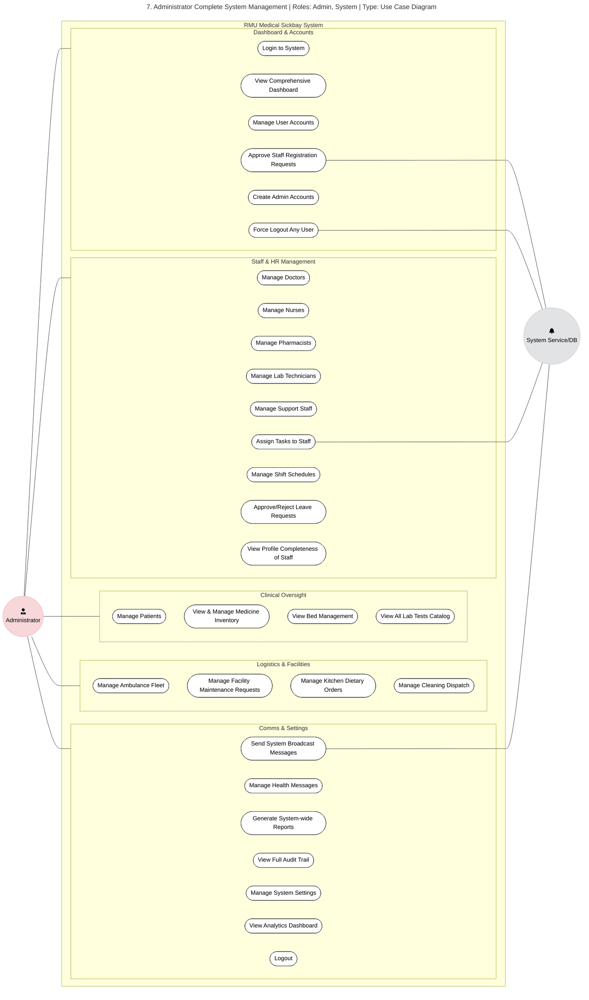

---

## 8. Pharmacist Complete System Operations
**Roles:** Pharmacist, Doctor, Patient, Administrator, System
**Type:** Use Case Diagram

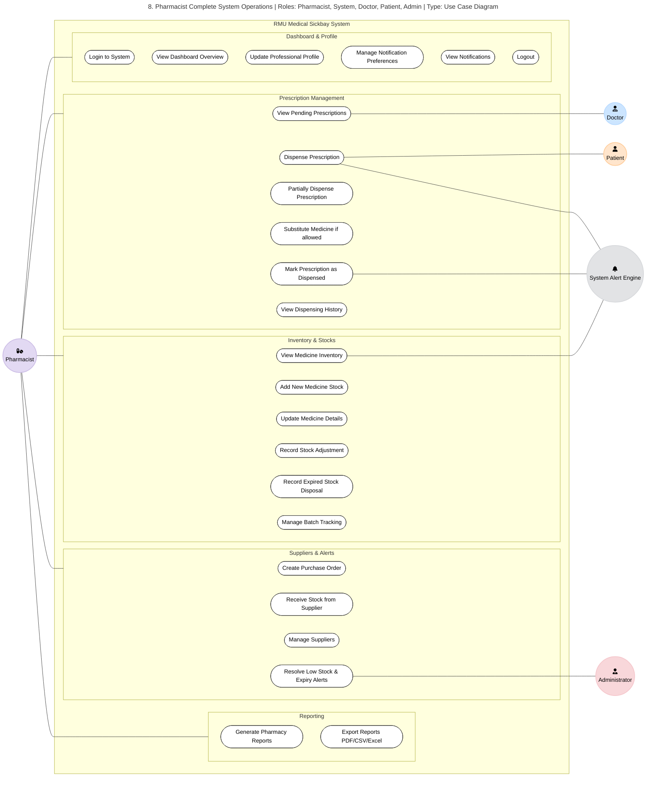

---

## 9. Lab Technician Complete System Operations
**Roles:** Lab Technician, Doctor, Administrator, System
**Type:** Use Case Diagram

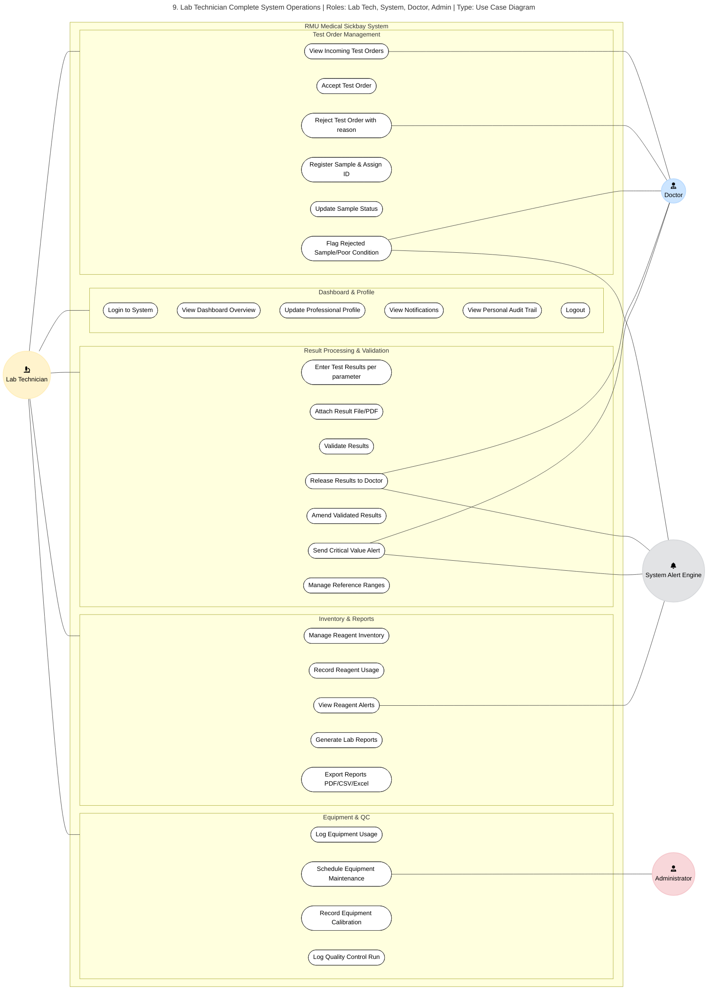

---

## 10. Nurse Complete System Operations
**Roles:** Nurse, Doctor, Administrator, System
**Type:** Use Case Diagram

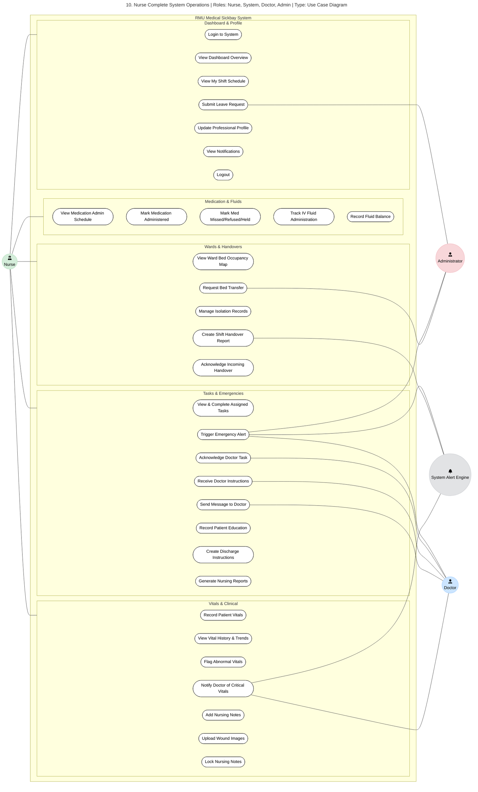

---

## 11. Ancillary & Support Staff System Operations
**Roles:** Ambulance Driver, Cleaner, Laundry Staff, Maintenance, Security, Kitchen Staff
**Type:** Use Case Diagram

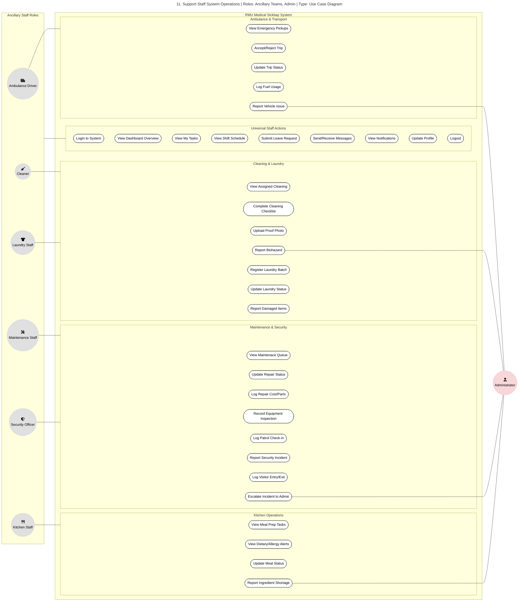
